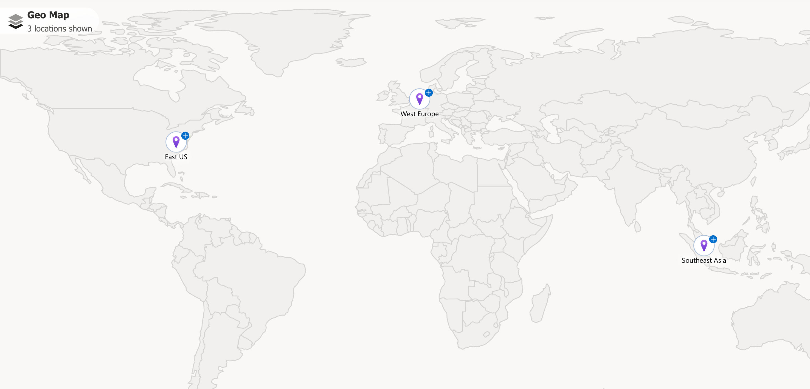
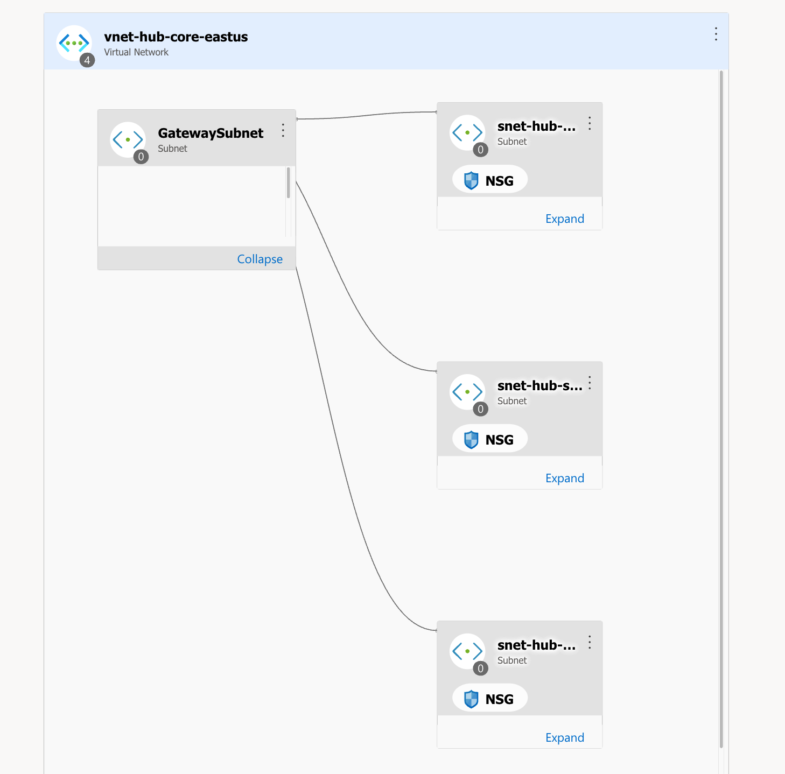
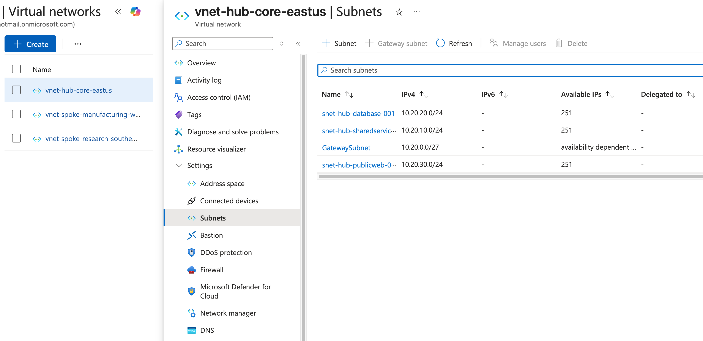
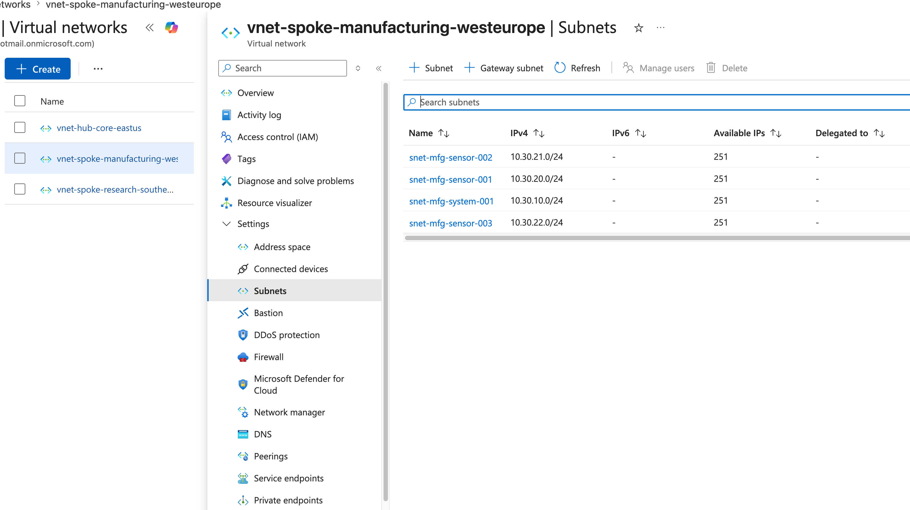
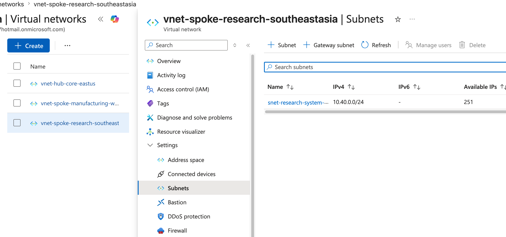

## M01 - Unit 4: Design and Implement a Virtual Network in Azure


## Architecture Overview
- Hub VNet (Connectivity) 
- Spoke VNet (Manufacturing)
- Spoke VNet (Research)


## Screenshots 

### Azure Geo Map


### Hub VNet Topology


### Hub Subnets


### Manufacturing Spoke


### Research Spoke



## Terraform Outputs (Verification)

These outputs confirm successful deployment of Azure networking resources:

```text id="outputs_final"
resource_group_name = "rg-contoso-connectivity-shared-eastus"

hub_vnet_id = "/subscriptions/.../virtualNetworks/vnet-hub-core-eastus"

hub_shared_services_subnet_id = "/subscriptions/.../subnets/snet-hub-sharedservices-001"

manufacturing_vnet_id = "/subscriptions/.../virtualNetworks/vnet-spoke-manufacturing-westeurope"

research_vnet_id = "/subscriptions/.../virtualNetworks/vnet-spoke-research-southeastasia"
