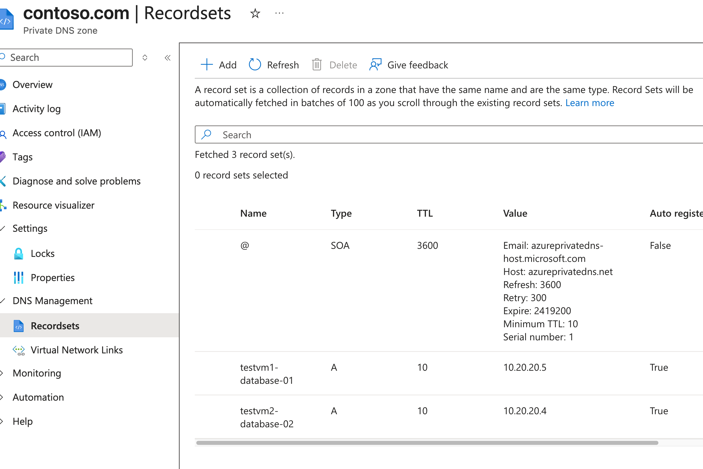
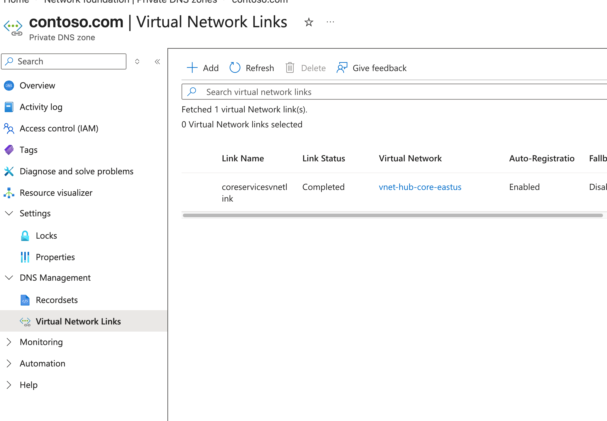
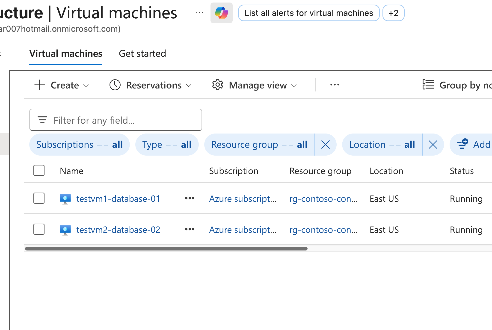
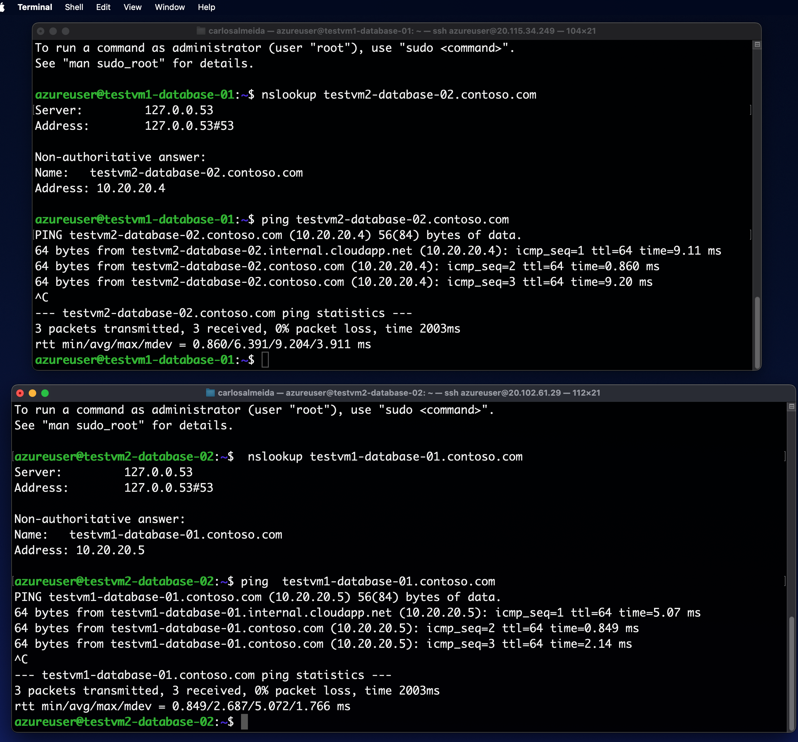
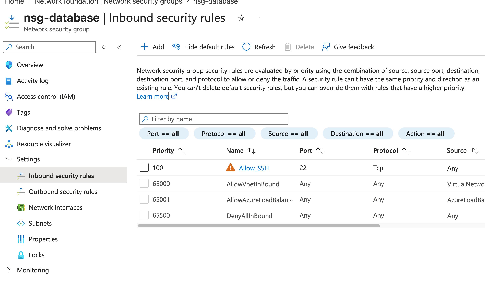
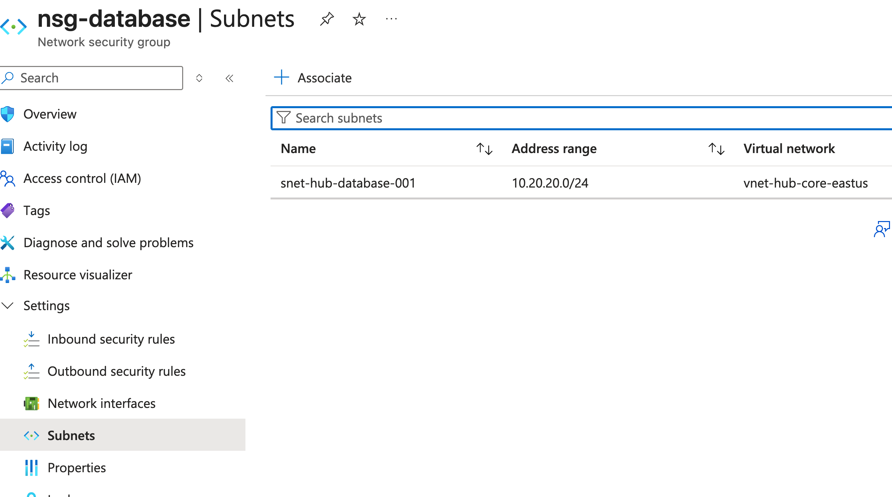

## M01 - Unit 6 Configure DNS settings in Azure

## Exercise Scenario
https://microsoftlearning.github.io/AZ-700-Designing-and-Implementing-Microsoft-Azure-Networking-Solutions/Instructions/Exercises/M01-Unit%206%20Configure%20DNS%20settings%20in%20Azure.html

## Architecture Overview
- Hub VNet (Connectivity) 
- Spoke VNet (Manufacturing)
- Spoke VNet (Research)

## Resources added in this lab
- Private DNS Zone 
- VNet DNS linking with auto-registration
- 2 Linux VMs for testing
- Network Security Group (NSG) allowing SSH (port 22)

## Screenshots 

### Private DNS Records

### Private DNS Vnetlink 

### Virtual Machines

### DNS Resolution Test

### Network Security Group (NSG)

## Terraform Outputs (Verification)
vm1_private_ip = "10.20.20.5"
vm1_public_ip = "20.115.34.249"
vm2_private_ip = "10.20.20.4"
vm2_public_ip = "20.102.61.29"
