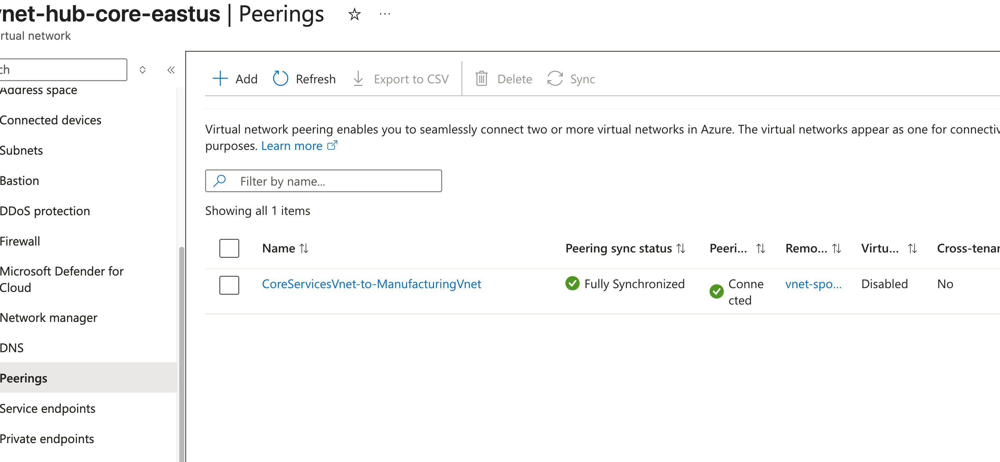
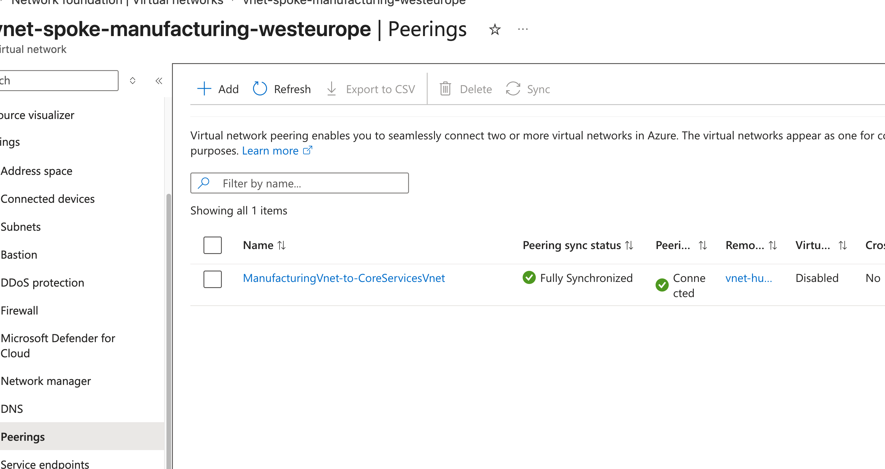
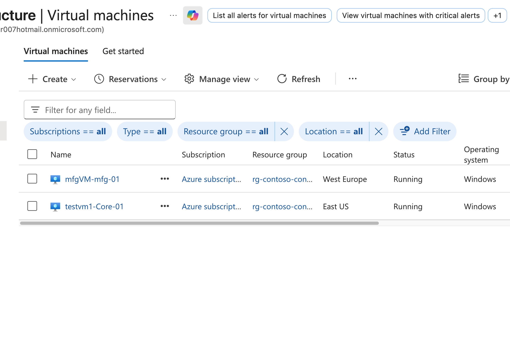
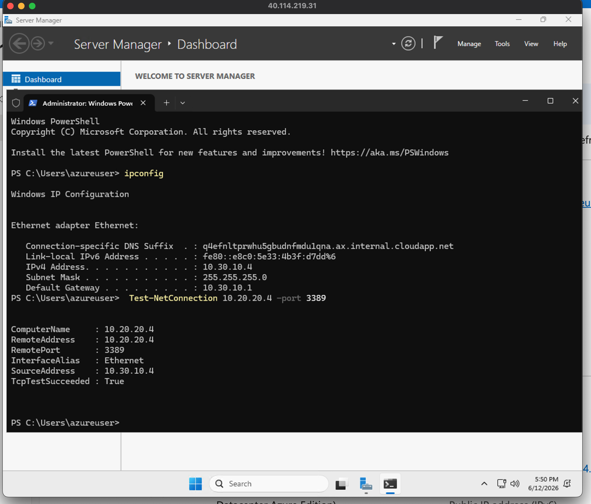
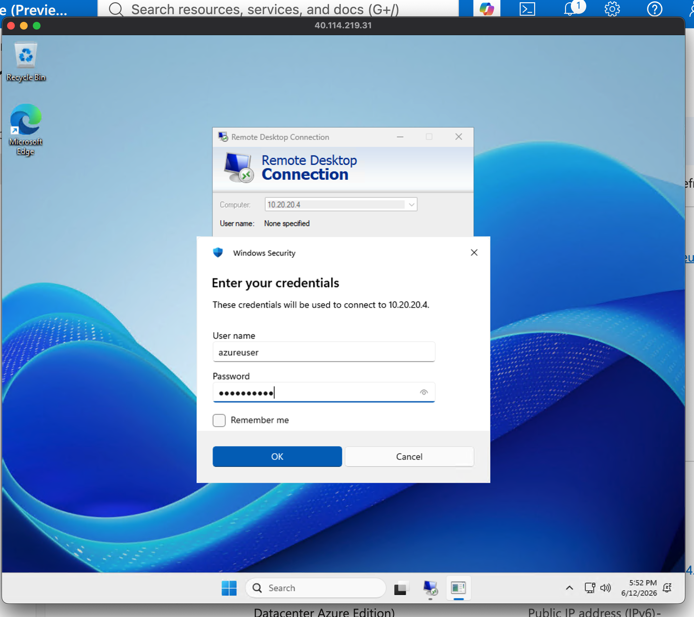
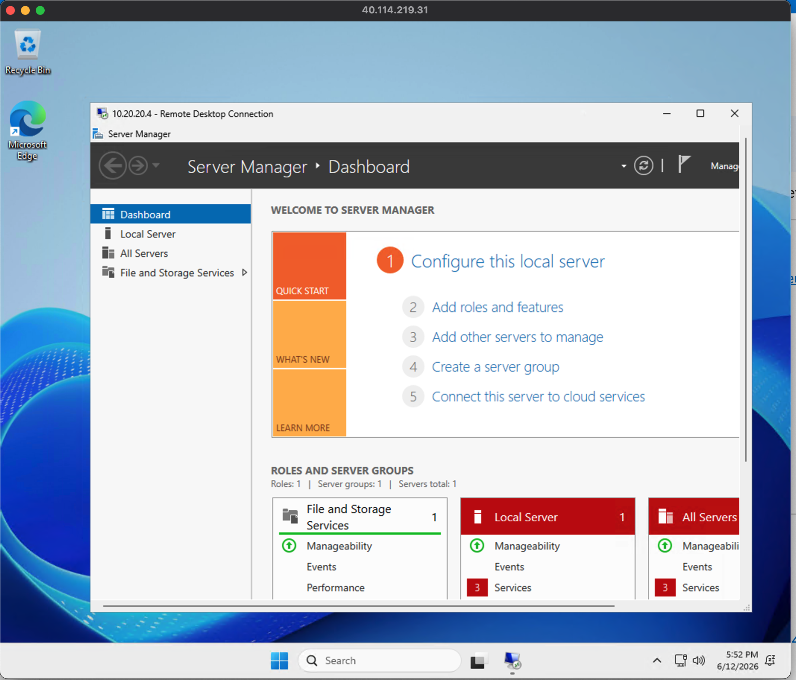
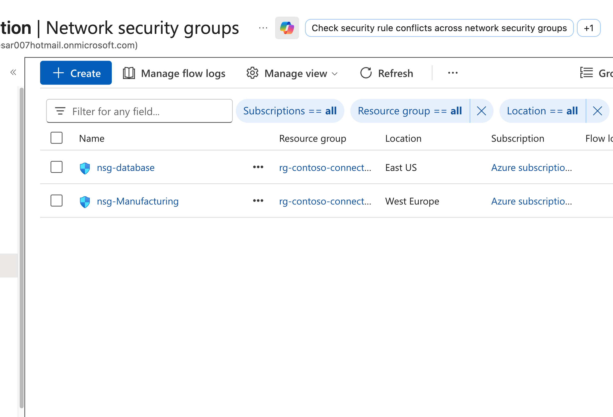
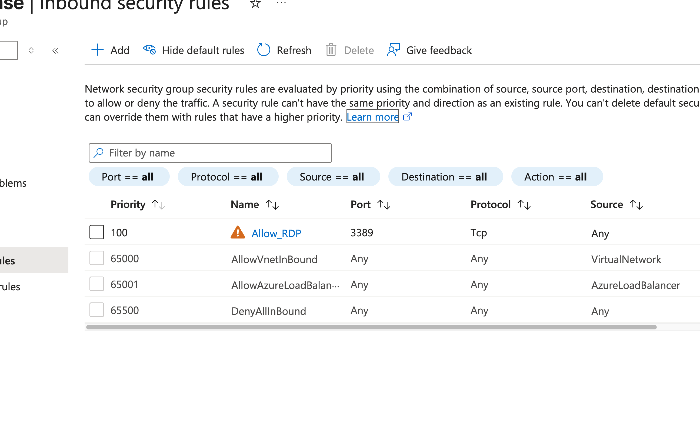

## M01 - Unit 8 Connect two Azure Virtual Networks using global virtual network peering

## Exercise Scenario
https://microsoftlearning.github.io/AZ-700-Designing-and-Implementing-Microsoft-Azure-Networking-Solutions/Instructions/Exercises/M01-Unit%208%20Connect%20two%20Azure%20Virtual%20Networks%20using%20global%20virtual%20network%20peering.html

## Architecture Overview
- Hub VNet (Connectivity) 
- Spoke VNet (Manufacturing)
- Spoke VNet (Research)

## Resources added in this lab
- Global Virtual Network Peering
- 2 × Windows Virtual Machines (test endpoints)
- Network Security Groups (NSG): RDP (3389) enabled for testing

## Connectivity Validation
The following validations were performed:
- VM-to-VM connectivity across VNets
- RDP access validation between networks
- Peering status confirmed as active

## Screenshots 

### Vnet Peering

### Private DNS Vnetlink 

### Virtual Machines

### Remote Access Test (RDP)

### Network Security Group (NSG)

## Terraform Outputs (Verification)

vm1_private_ip = "10.20.20.4"
vm1_public_ip = "172.174.31.197"
vm2_private_ip = "10.30.10.4"
vm2_public_ip = "40.114.219.31"
