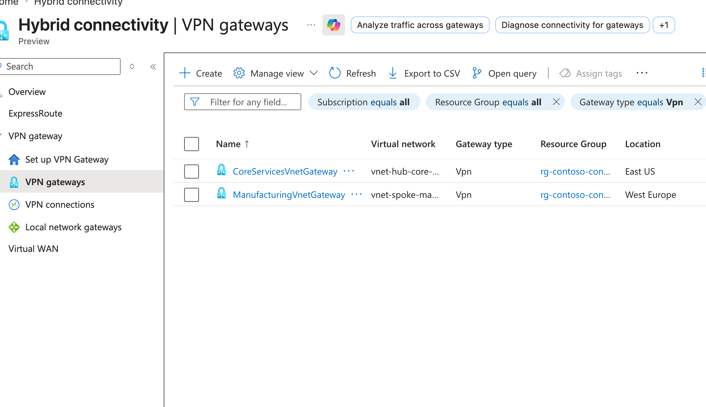
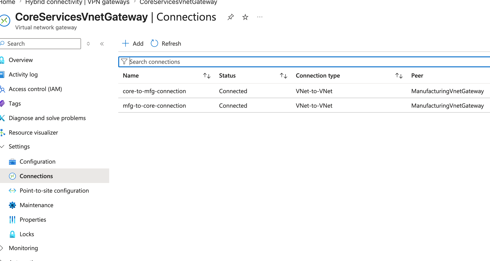
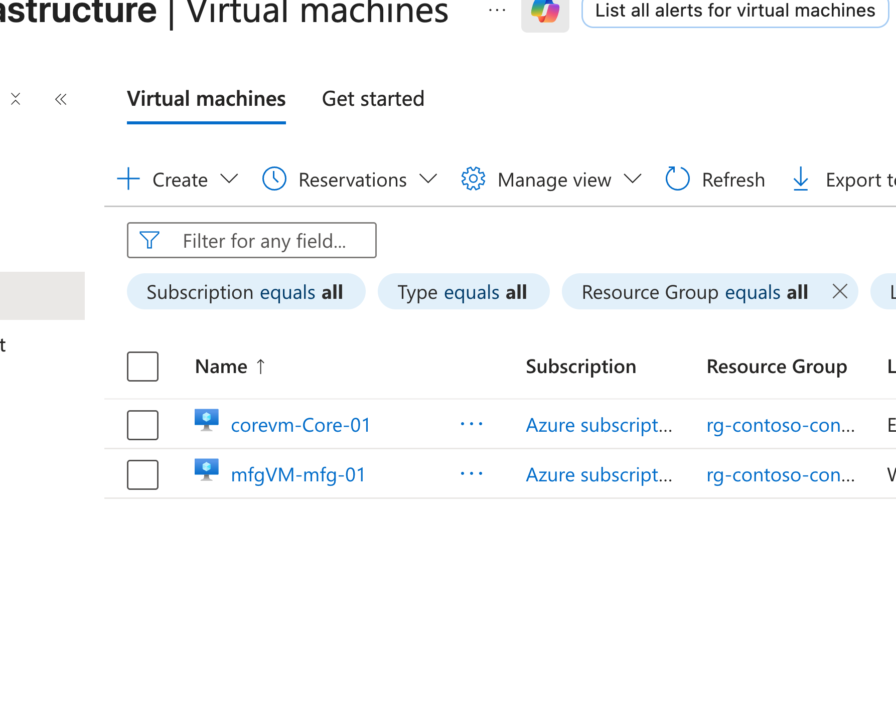
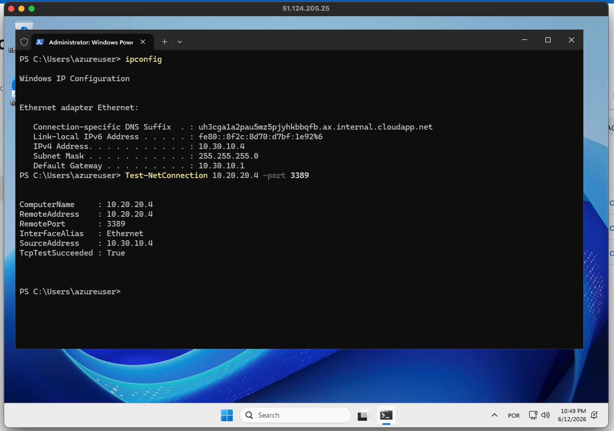
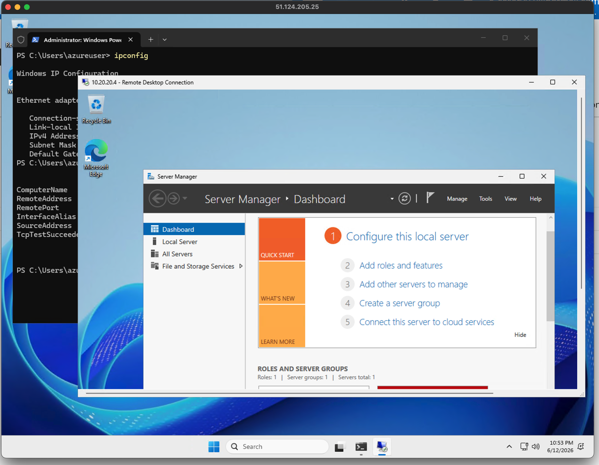
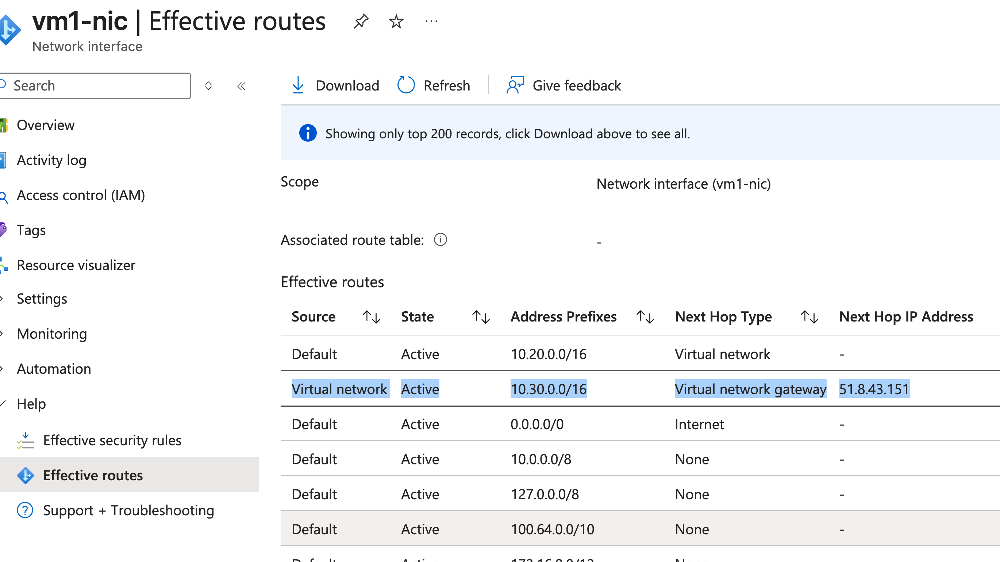
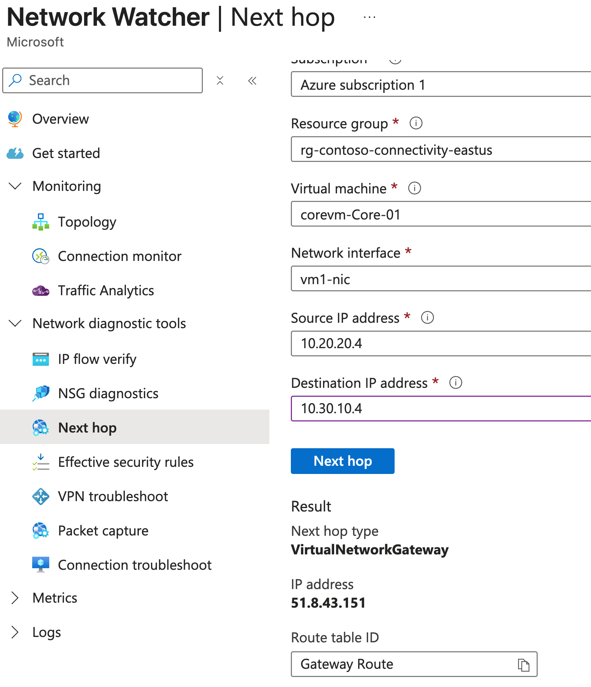

## M02-Unit 3 Create and configure a virtual network gateway

## Exercise Scenario
https://microsoftlearning.github.io/AZ-700-Designing-and-Implementing-Microsoft-Azure-Networking-Solutions/Instructions/Exercises/M02-Unit%203%20Create%20and%20configure%20a%20virtual%20network%20gateway.html

## Architecture Overview
- Hub VNet (Connectivity) 
- Spoke VNet (Manufacturing)
- Spoke VNet (Research)

## Resources added in this lab
- VPN Gateway and all related configs
- 2 × Windows Virtual Machines (test endpoints)
- Network Security Groups (NSG): RDP (3389) enabled for testing

## Connectivity Validation
The following validations were performed:
- VM-to-VM connectivity across VNets via VPN Gateway
- RDP access validation between networks
- VPN status confirmed as active

## Screenshots 

### VNet to Vnet VPN Status

### Virtual Machines

### Remote Access Test (RDP)

### Routing Verification

## Terraform Outputs (Verification)

core_gateway_public_ip = "51.8.43.151"
mfg_gateway_public_ip = "20.23.185.75"
vm1_private_ip = "10.20.20.4"
vm1_public_ip = "20.115.17.34"
vm2_private_ip = "10.30.10.4"
vm2_public_ip = "51.124.205.25"
vpn_connection_id = "/subscriptions/.../resourceGroups/rg-contoso-connectivity-eastus/providers/Microsoft.Network/connections/core-to-mfg-connection"
