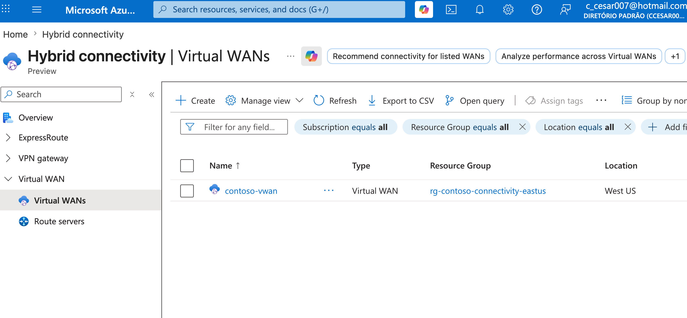
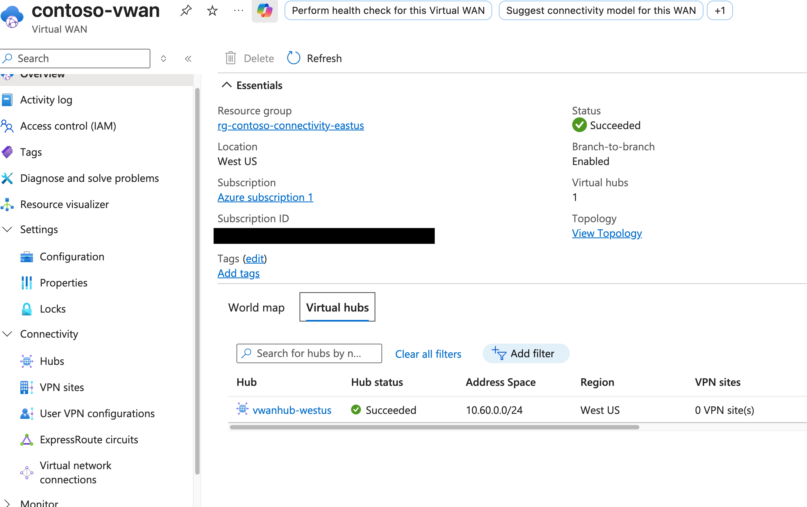
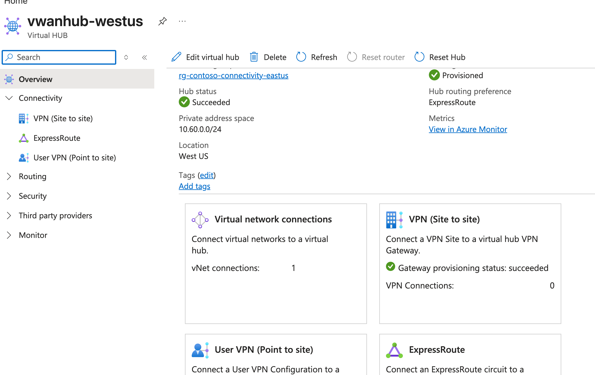
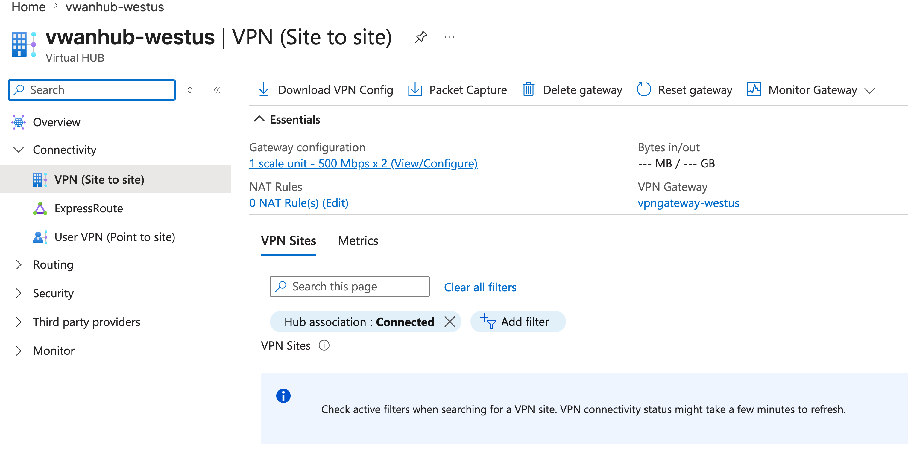
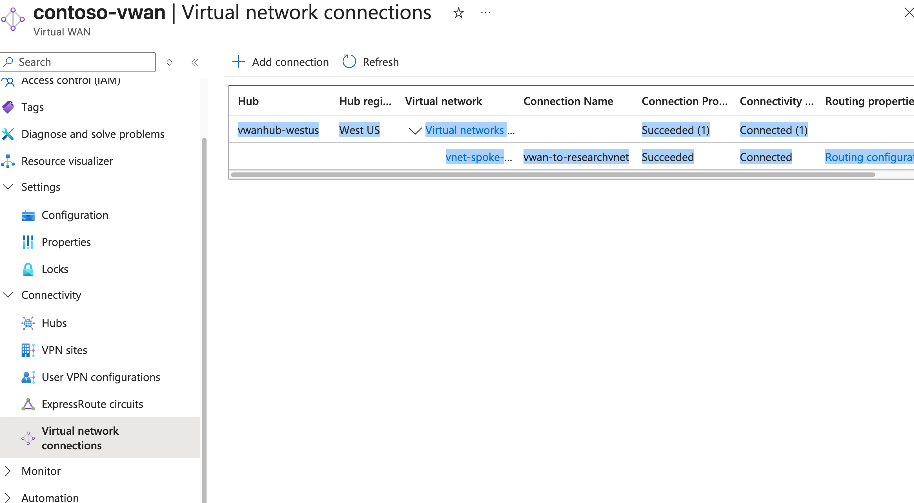
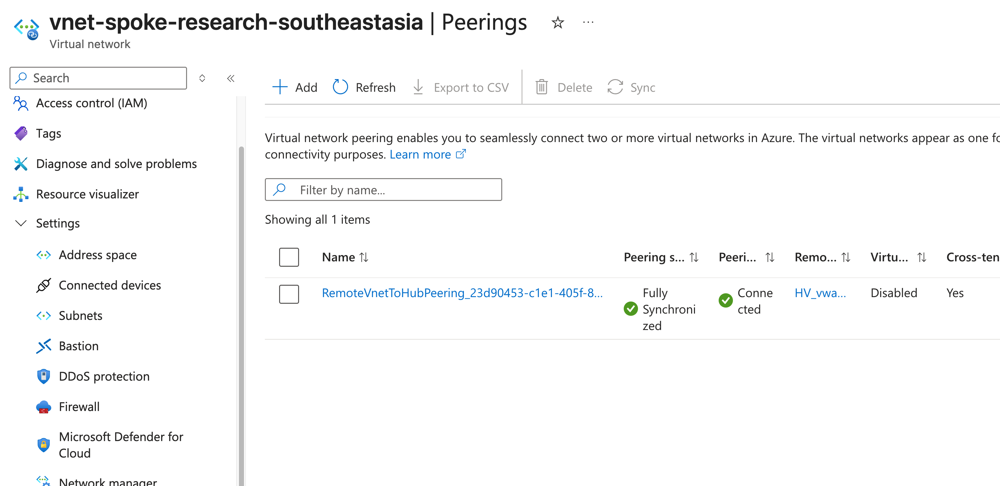

## M02-Unit 7 Create a Virtual WAN

## Exercise Scenario
https://microsoftlearning.github.io/AZ-700-Designing-and-Implementing-Microsoft-Azure-Networking-Solutions/Instructions/Exercises/M02-Unit%207%20Create%20a%20Virtual%20WAN%20by%20using%20Azure%20Portal.html

## Architecture Overview
- Hub VNet (Connectivity) 
- Spoke VNet (Manufacturing)
- Spoke VNet (Research)

## Resources added in this lab
- Virtual WAN
- Virtual Hub
- VPN Gateway S2S

## Connectivity Validation
The following validations were performed:
- Virtual Wan and Virtual Hub Successfully deployed
- Vnet Research connected to Virtual Hub
- Connectivity status verified from Azure Portal

## Screenshots 

### VWAN Deployed

### Virtual Hub and VPN Gateway S2S deployed

### Vnet Connection to Virtual Hub

