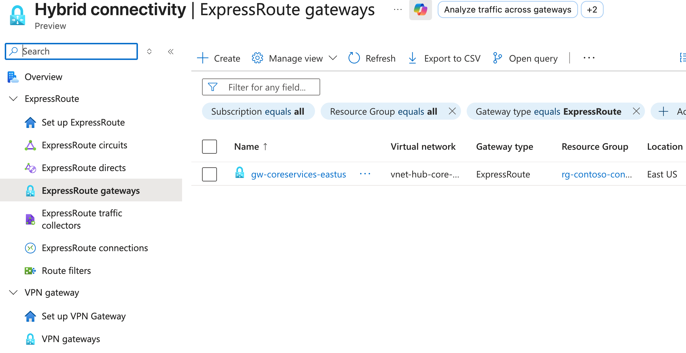
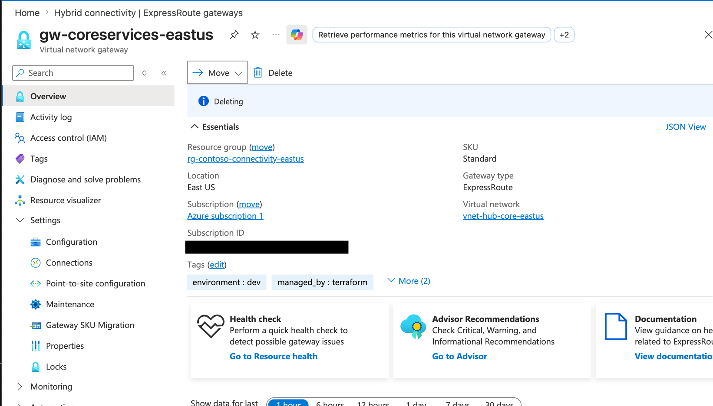

## M03-Unit 4 Configure an ExpressRoute Gateway

## Exercise Scenario
https://microsoftlearning.github.io/AZ-700-Designing-and-Implementing-Microsoft-Azure-Networking-Solutions/Instructions/Exercises/M03-Unit%204%20Configure%20an%20ExpressRoute%20Gateway.html

## Architecture Overview
- Hub VNet (Connectivity) 
- Spoke VNet (Manufacturing)
- Spoke VNet (Research)

## Resources added in this lab
- ExpressRoute Gateway 
- Public IP Address for the gateway

## Screenshots 
### ExpressRoute Verification

## Terraform Outputs (Verification)

ExpressRoute_pip = "52.188.126.189"
expressroute_gateway_id = "/subscriptions/ .../resourceGroups/rg-contoso-connectivity-eastus/providers/Microsoft.Network/virtualNetworkGateways/gw-coreservices-eastus"
expressroute_gateway_name = "gw-coreservices-eastus"
gateway_public_ip_id = "/subscriptions/ .../resourceGroups/rg-contoso-connectivity-eastus/providers/Microsoft.Network/publicIPAddresses/ergw-pip-estaus-001"
gateway_subnet_id = "/subscriptions/ .../resourceGroups/rg-contoso-connectivity-eastus/providers/Microsoft.Network/virtualNetworks/vnet-hub-core-eastus/subnets/GatewaySubnet"
resource_group_name = "rg-contoso-connectivity-eastus"