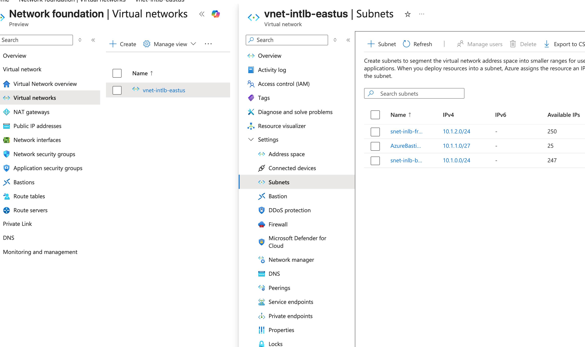
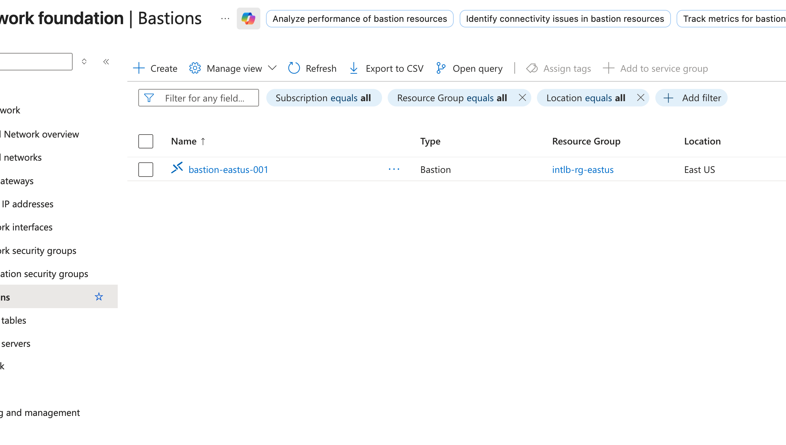
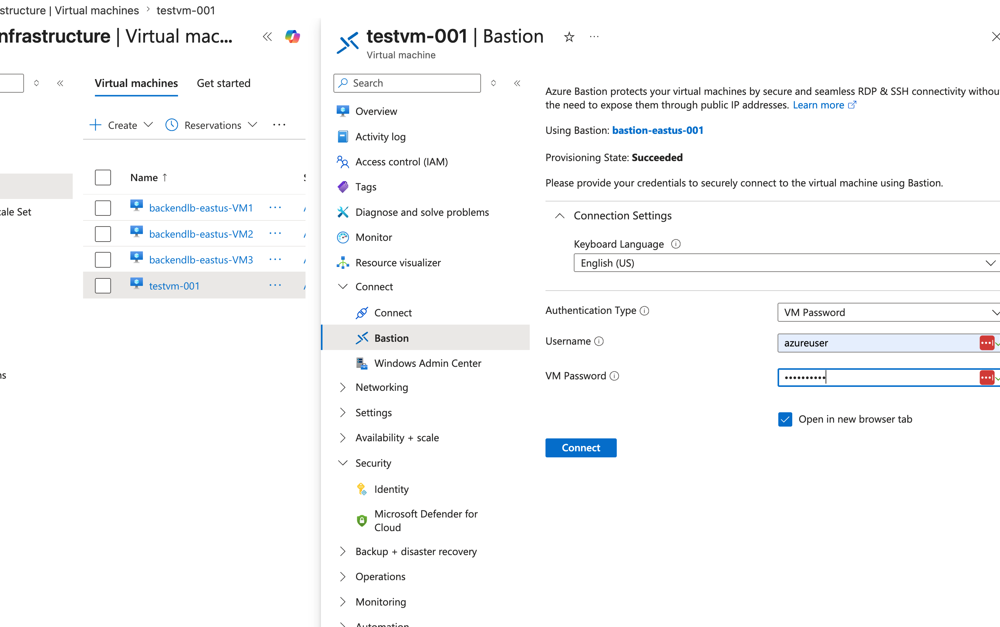
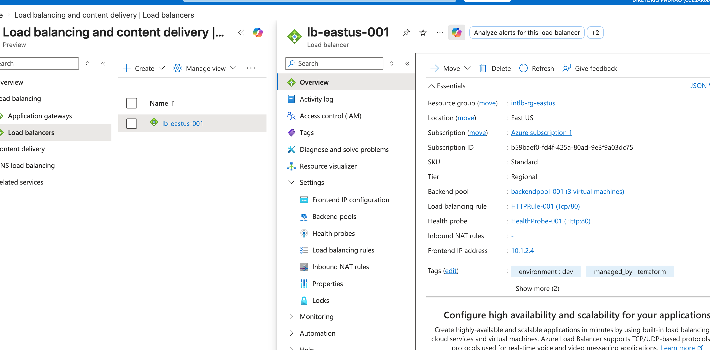
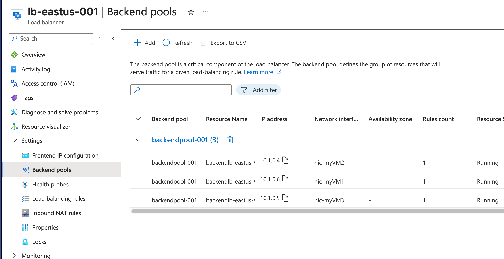
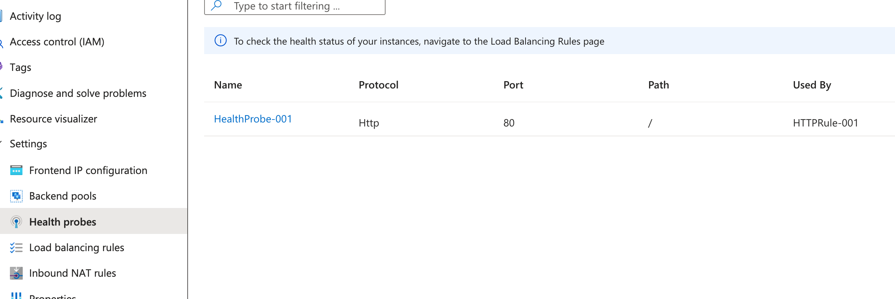
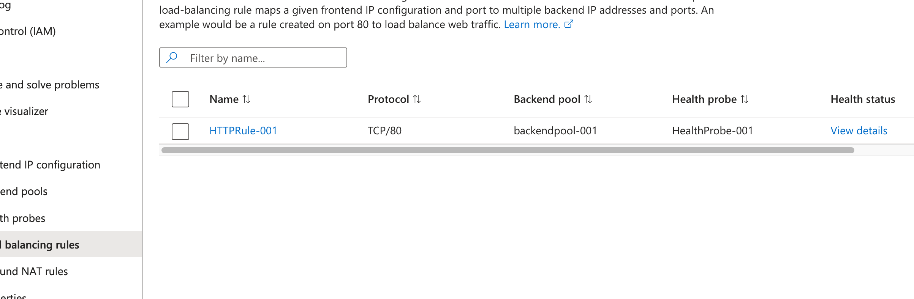
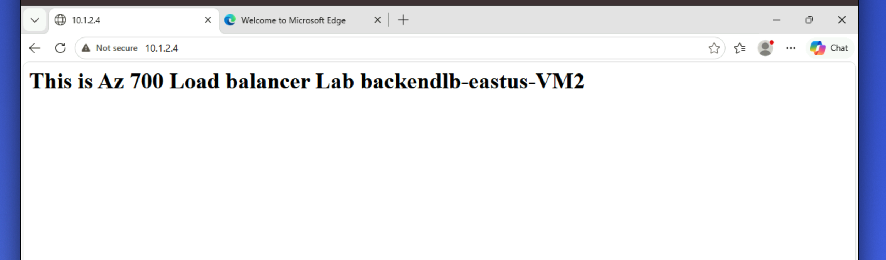
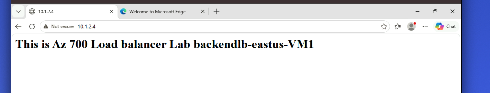
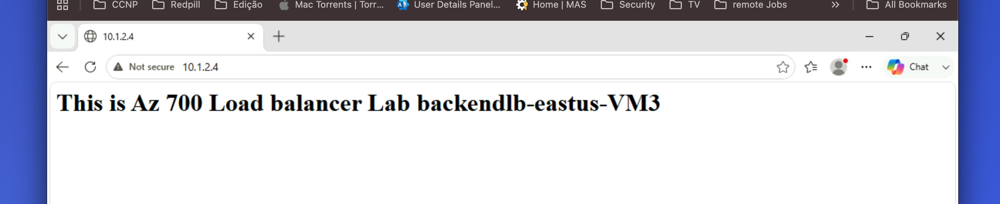

## M04 Unit 4 Create and configure an Azure load balancer

## Exercise Scenario
https://microsoftlearning.github.io/AZ-700-Designing-and-Implementing-Microsoft-Azure-Networking-Solutions/Instructions/Exercises/M04-Unit%204%20Create%20and%20configure%20an%20Azure%20load%20balancer.html

## Architecture Overview
Deployed an Azure Internal Load Balancer to distribute traffic across backend web servers in a private network using Terraform. The design validates Layer 4 load balancing, health probes, and private connectivity.

## Azure Resources Deployed
- Azure Internal Standard Load Balancer 
- Virtual Network and Subnets
- Azure Bastion
- 3 Linux Web Servers VMs(Backend Pool)
- 1 Windows Client VM

## Traffic Flow
- Client VM → Internal Load Balancer → Backend Pool → Web Servers

## Connectivity Validation
The following validations were performed:
- Web traffic successfully routed via Internal Load Balancer
- Backend pool distribution verified from client VM
- Private IP access confirmed

## Screenshots 

### Virtual Network and Subnets

### Bastion

### Load Balancer

### Load Balancing Test

## Terraform Outputs (Verification)
lb_private_ip = "10.1.2.4"