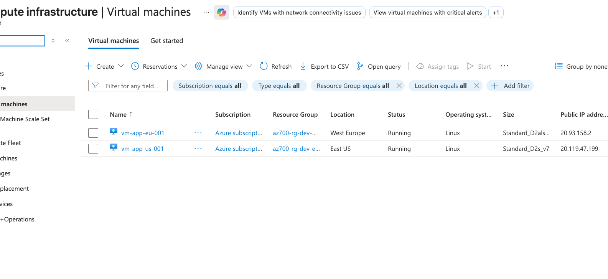
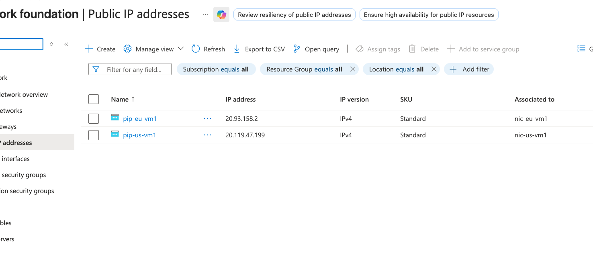
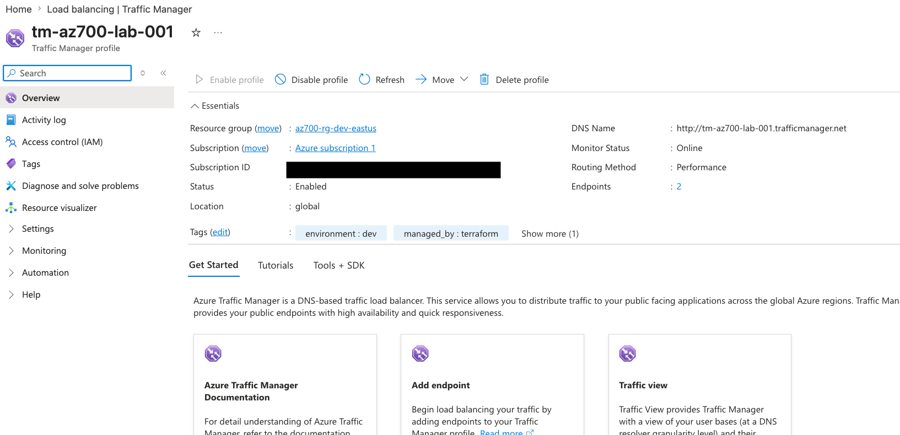
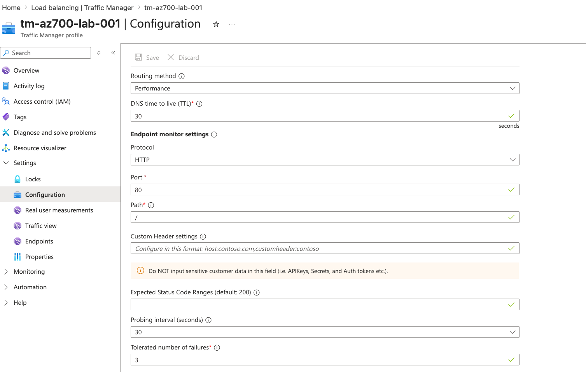
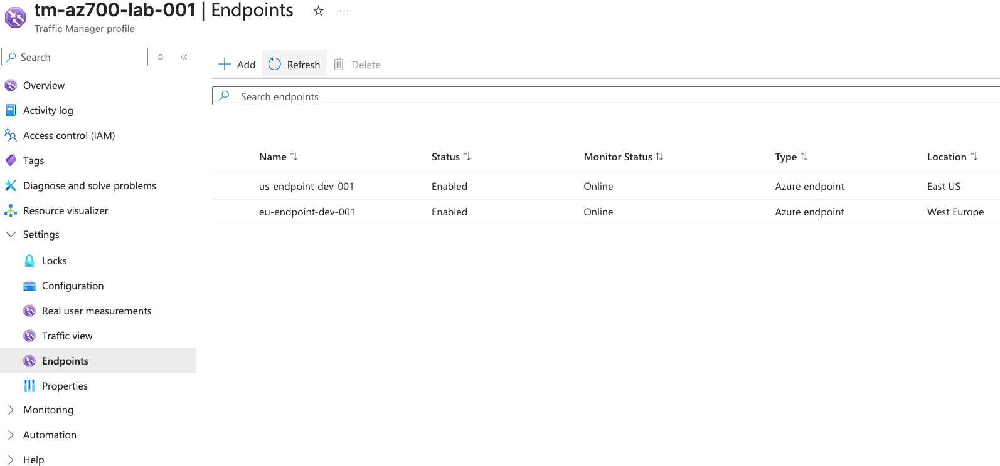
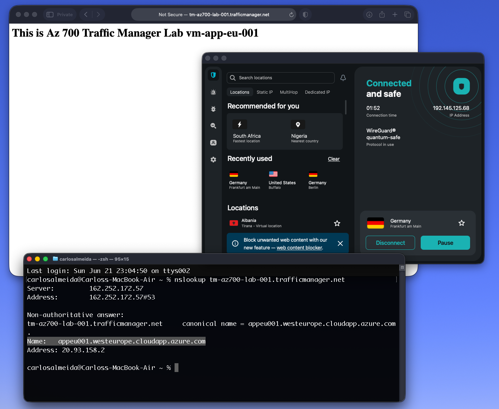
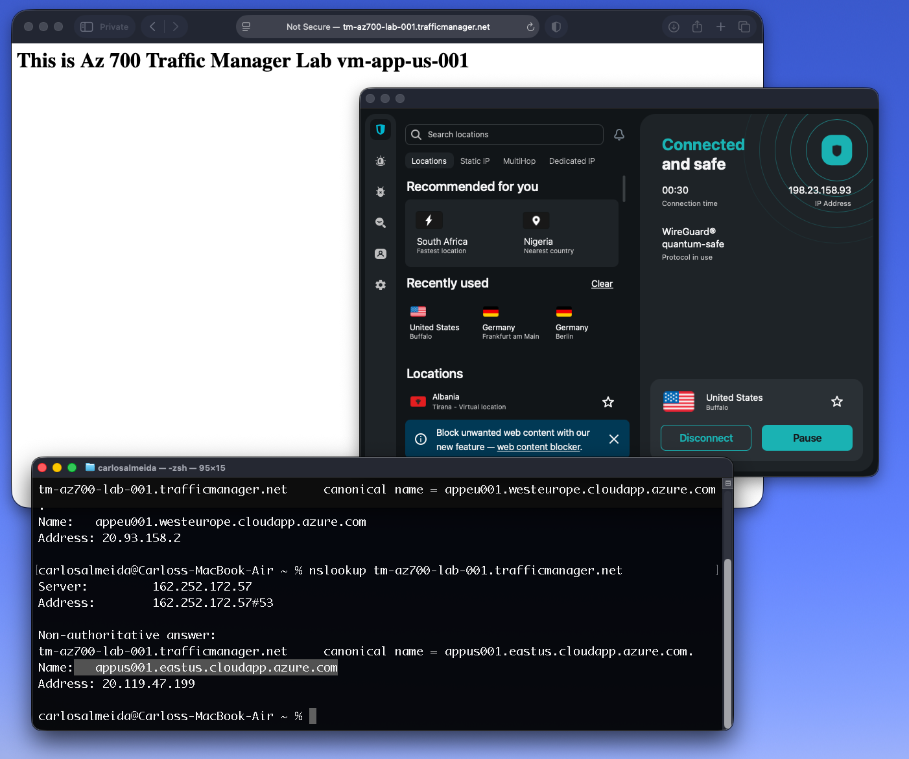

## M04 Unit 6 Create a Traffic Manager Profile

## Exercise Scenario
https://microsoftlearning.github.io/AZ-700-Designing-and-Implementing-Microsoft-Azure-Networking-Solutions/Instructions/Exercises/M04-Unit%206%20Create%20a%20Traffic%20Manager%20profile%20using%20the%20Azure%20portal.html

## Architecture Overview
Deployed a multi-region web application architecture using Terraform and Azure Traffic Manager. The solution distributes user traffic between East US and West Europe application endpoints using Performance routing, directing users to the closest healthy endpoint.

## Azure Resources Deployed
- Azure Traffic Manager (Performance Routing)
- 2 Virtual Networks
- 2 Application Subnets
- 2 Network Security Groups
- 2 Ubuntu Linux Virtual Machines (Nginx Web Servers)
- 2 Standard Public IP Addresses
- Cloud-Init Configuration

## Traffic Flow
- Internet User → Azure Traffic Manager → Closest Healthy Endpoint → Nginx Web Server

## Connectivity Validation
The following validations were performed:
- Traffic Manager profile successfully deployed
- Endpoint health monitoring validated
- East US endpoint accessible
- West Europe endpoint accessible
- Traffic Manager DNS endpoint resolved successfully in both Regions, using a VPN to change source IP Clients
- Performance routing functioning between regions

## Screenshots 
### Virtual Machines

### Regional Public IPS

### Traffic Manager Profile

### Traffic Tests

## Terraform Outputs (Verification)
app_eu_fqdn = "appeu001.westeurope.cloudapp.azure.com"
app_us_fqdn = "appus001.eastus.cloudapp.azure.com"
traffic_manager_fqdn = "tm-az700-lab-001.trafficmanager.net"