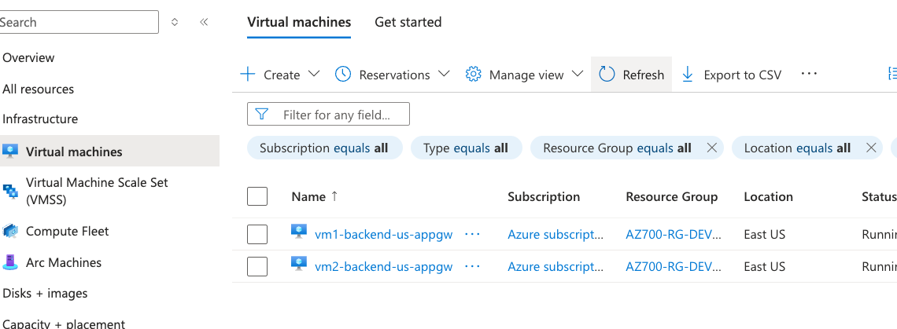
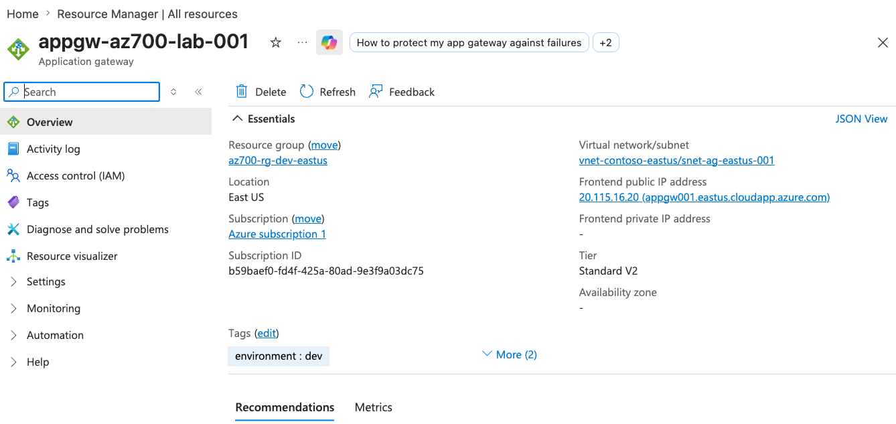
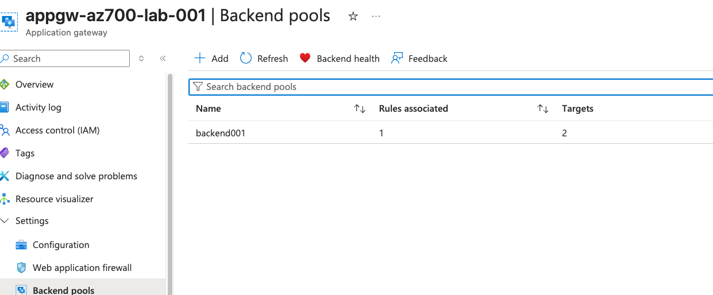
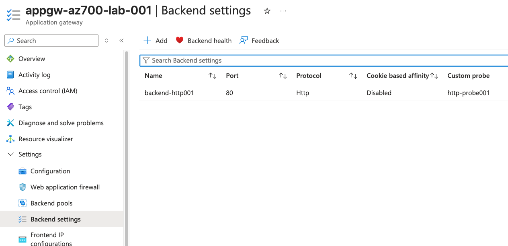
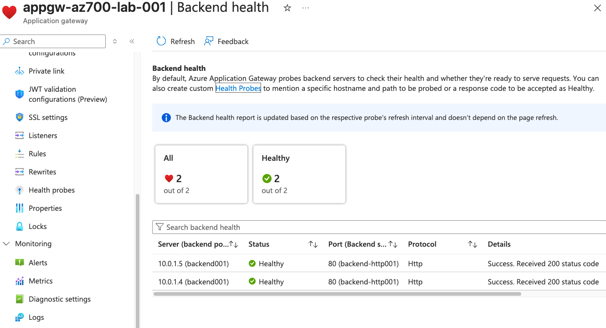
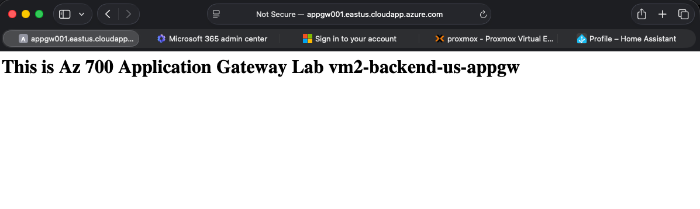
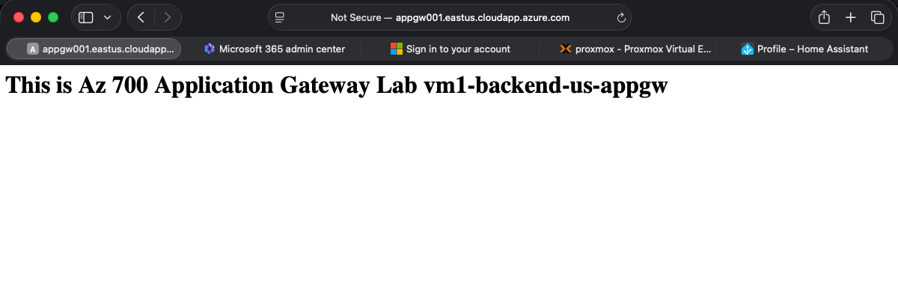

## M05 Unit 04 Deploy Azure Application Gateway

## Exercise Scenario
https://microsoftlearning.github.io/AZ-700-Designing-and-Implementing-Microsoft-Azure-Networking-Solutions/Instructions/Exercises/M05-Unit%204%20Deploy%20Azure%20application%20gateway.html

## Architecture Overview
Deployed an Azure Application Gateway (Layer 7 Load Balancer) to distribute HTTP traffic across two backend web servers. 

## Azure Resources Deployed
- Azure Application Gateway (Standard_v2)
- Azure Virtual Network
- Application Gateway Subnet
- Backend Subnet
- Public IP Address
- 2 Windows Virtual Machines (Nginx web server)
- 2 Network Interfaces

## Traffic Flow
- Internet User → Application Gateway Public IP → HTTP Listener → Routing Rule → Backend Pool → Nginx web server

## Connectivity Validation
The following validations were performed:
- Application Gateway deployed successfully
- Frontend public IP assigned and accessible
- Backend pool configured successfully
- BackendVM1 added to backend pool
- BackendVM2 added to backend pool
- Backend health status validated as healthy
- HTTP listener configured successfully
- Routing rule functioning correctly
- Nginx web server accessible through Application Gateway
- Browser refreshes distributed traffic across Backend Virtual machines

## Screenshots 

### Virtual Machines

### Traffic Manager Profile

### Traffic Distribution Tests

## Terraform Outputs (Verification)
application_gateway_fqdn = "appgw001.eastus.cloudapp.azure.com"