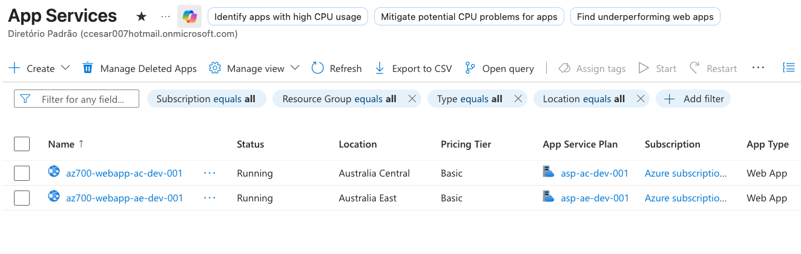
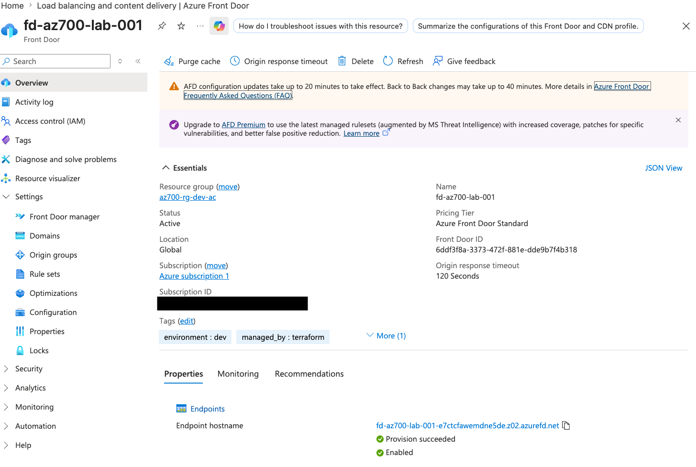
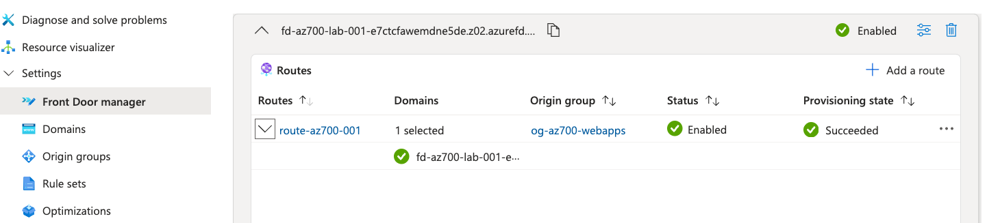
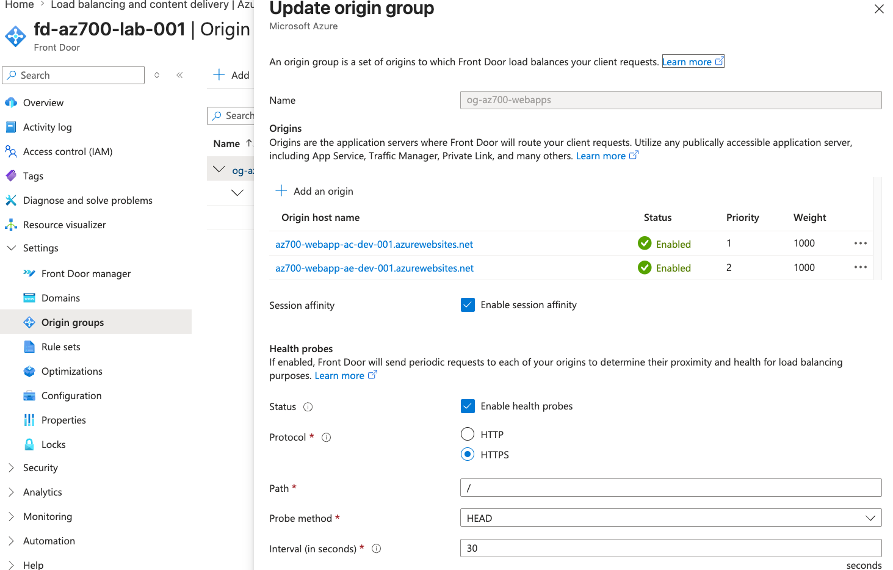
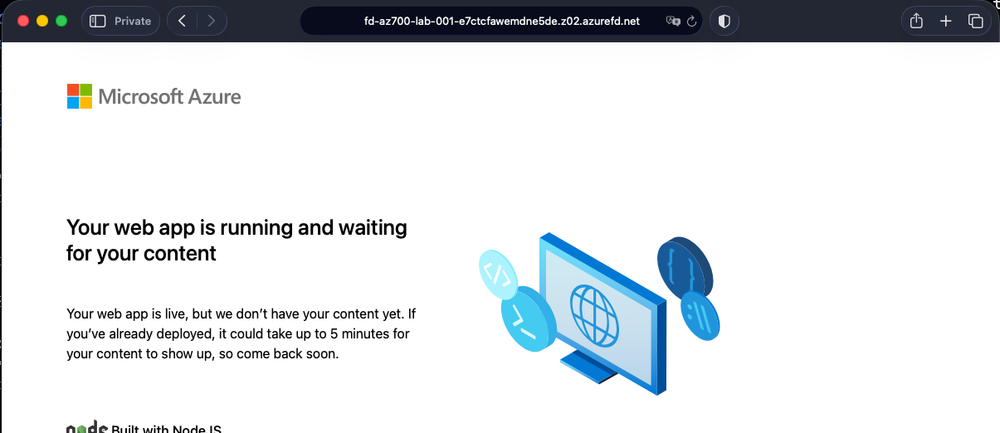
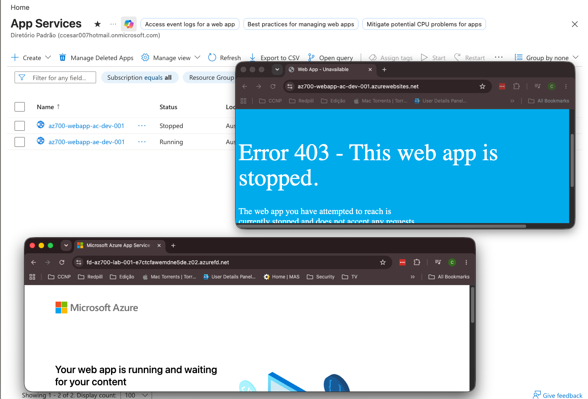

## M05 Unit 06 Create a Front Door for a Highly Available Web Application

## Exercise Scenario
https://microsoftlearning.github.io/AZ-700-Designing-and-Implementing-Microsoft-Azure-Networking-Solutions/Instructions/Exercises/M05-Unit%206%20Create%20a%20front%20door%20for%20a%20highly%20available%20web%20application%20using%20the%20Azure%20portal.html

## Architecture Overview
Deployed an Azure Front Door (Layer 7 Global Load Balancer) to distribute HTTPS traffic across two backend web applications in different regions, providing high availability and automatic failover.

## Azure Resources Deployed
- Azure Front Door Profile (Standard tier)
- 2 App Service Plans (Linux B1)
- 2 Linux Web Apps (Node.js 22 LTS)

## Traffic Flow
- Internet User → Front Door Endpoint → Origin Group → Priority Routing → Primary Web App (Australia Central) → Failover Web App (Australia East)

## Connectivity Validation
The following validations were performed:
- Front Door profile deployed successfully
- Endpoint FQDN assigned and accessible
- Origin group configured with health probes
- Primary origin (Australia Central) added and healthy
- Failover origin (Australia East) added and healthy
- HTTPS redirect configured and functioning
- Priority routing validated (primary → failover)
- Web apps accessible directly via azurewebsites.net
- Web apps accessible through Front Door endpoint
- Failover tested by stopping primary web app

## Screenshots

### Web Applications

### Front Door Profile

### Traffic Distribution Test

## Terraform Outputs (Verification)
front_door_endpoint_fqdn = "fd-az700-lab-001-e7ctcfawemdne5de.z02.azurefd.net"
primary_webapp_url        = "az700-webapp-ac-dev-001.azurewebsites.net"
failover_webapp_url       = "az700-webapp-ae-dev-001.azurewebsites.net"
