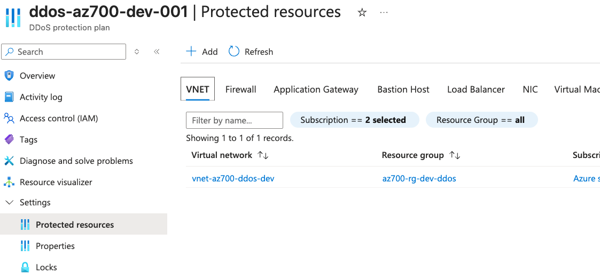
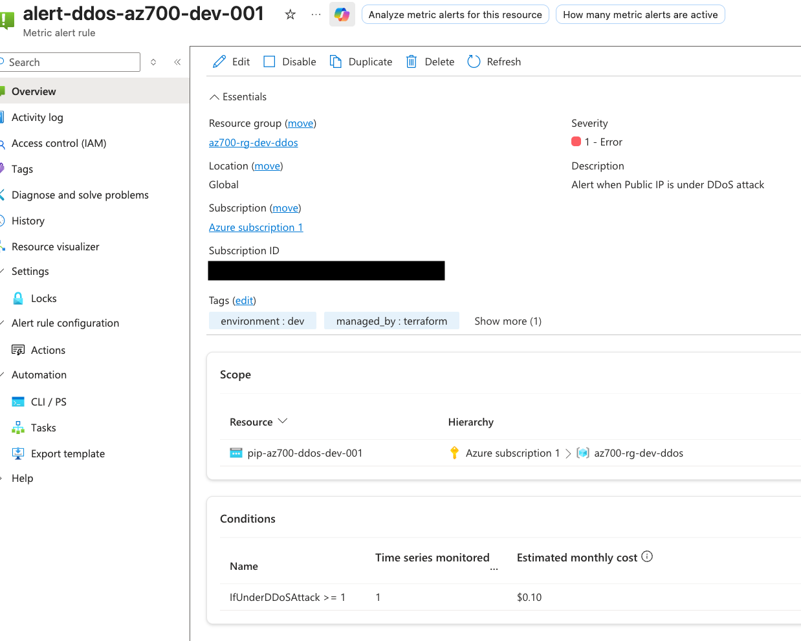
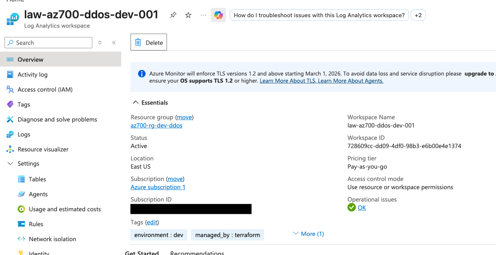

## M06 Unit 04 Configure DDoS Protection on a Virtual Network

## Exercise Scenario
https://microsoftlearning.github.io/AZ-700-Designing-and-Implementing-Microsoft-Azure-Networking-Solutions/Instructions/Exercises/M06-Unit%204%20Configure%20DDoS%20Protection%20on%20a%20virtual%20network%20using%20the%20Azure%20portal.html

## Architecture Overview
Configured Azure DDoS Network Protection on a Virtual Network, enabling volumetric attack mitigation, diagnostic logging, and metric-based alerting on a Public IP address.

## Azure Resources Deployed
- Azure DDoS Network Protection Plan
- Azure Virtual Network (DDoS Protection enabled)
- Public IP Address (Standard SKU)
- A Linux Virtual Machine
- Log Analytics Workspace
- Diagnostic Settings 
- Monitor Metric Alert 

## Traffic Flow
- Internet → Public IP (DDoS Protected) → NIC → Virtual Machine

## Connectivity Validation
The following validations were performed:
- DDoS Protection Plan deployed successfully
- DDoS Protection Plan associated to Virtual Network
- Virtual Network confirmed DDoS protection enabled
- Log Analytics Workspace receiving diagnostic data
- Metric alert rule created on IfUnderDDoSAttack metric

## Screenshots

### DDoS Protection Plan with Protected Vnet

### Alert Rule

### Log Analytics Workspace

## Terraform Outputs (Verification)
ddos_protection_plan_id    = "/subscriptions/b59baef0-fd4f-425a-80ad-9e3f9a03dc75/resourceGroups/az700-rg-dev-ddos/providers/Microsoft.Network/ddosProtectionPlans/ddos-az700-dev-001"
log_analytics_workspace_id = "/subscriptions/b59baef0-fd4f-425a-80ad-9e3f9a03dc75/resourceGroups/az700-rg-dev-ddos/providers/Microsoft.OperationalInsights/workspaces/law-az700-ddos-dev-001"
public_ip_address          = "172.174.90.178"
public_ip_fqdn             = "az700ddos.eastus.cloudapp.azure.com"