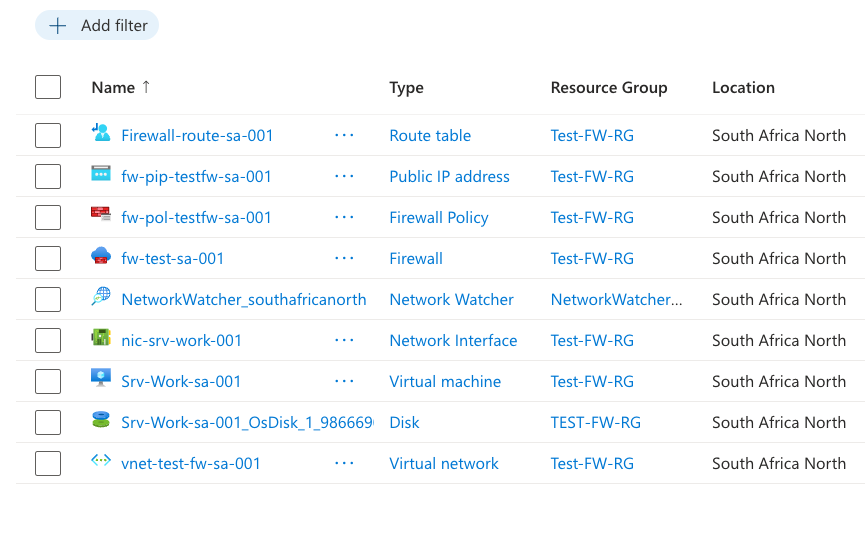
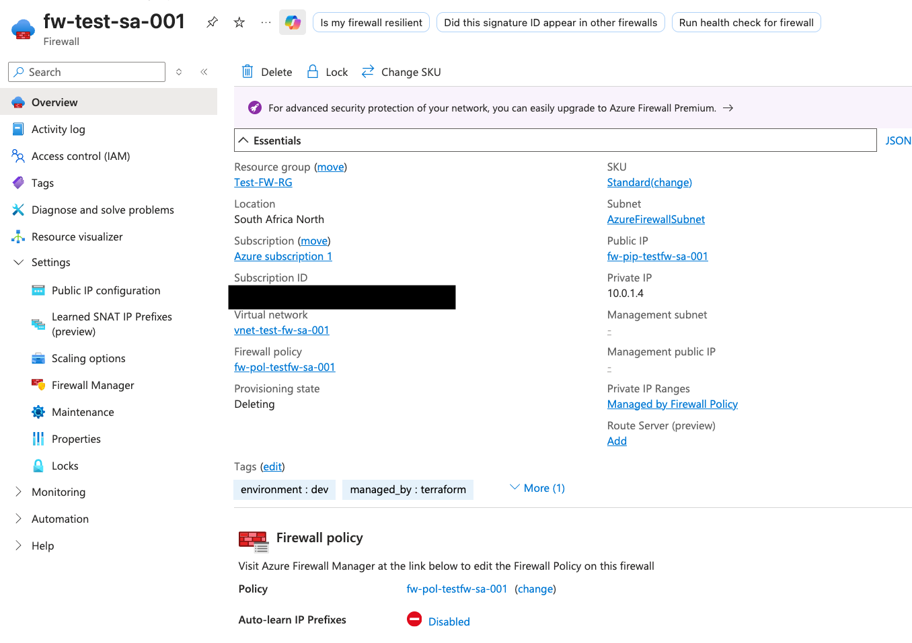
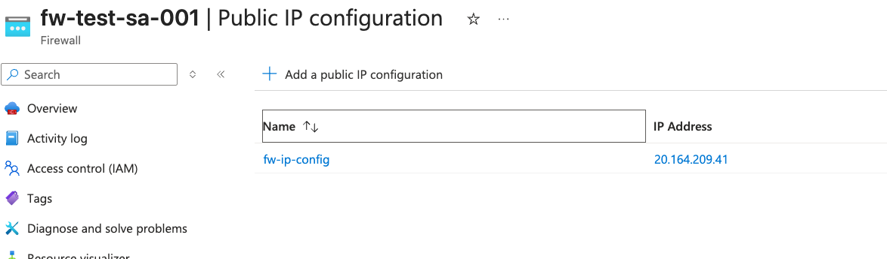
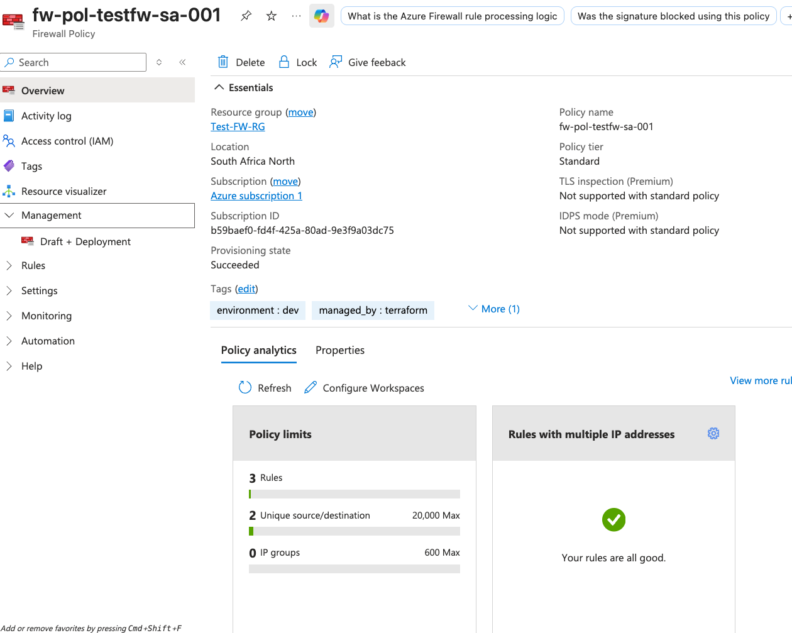
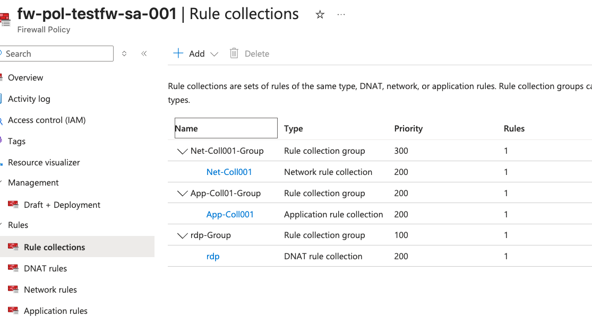
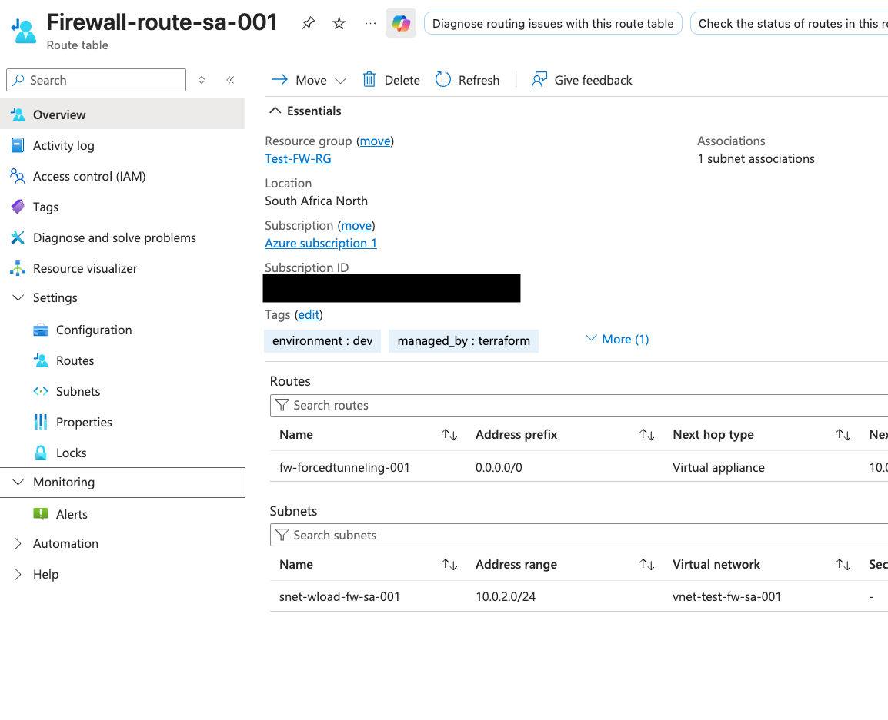
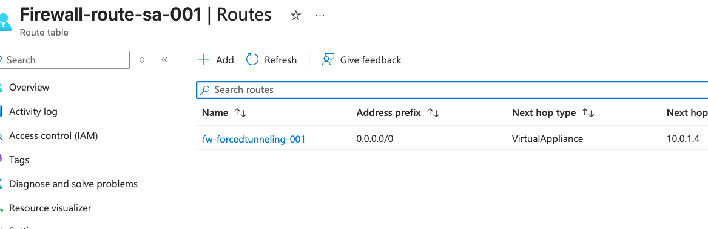
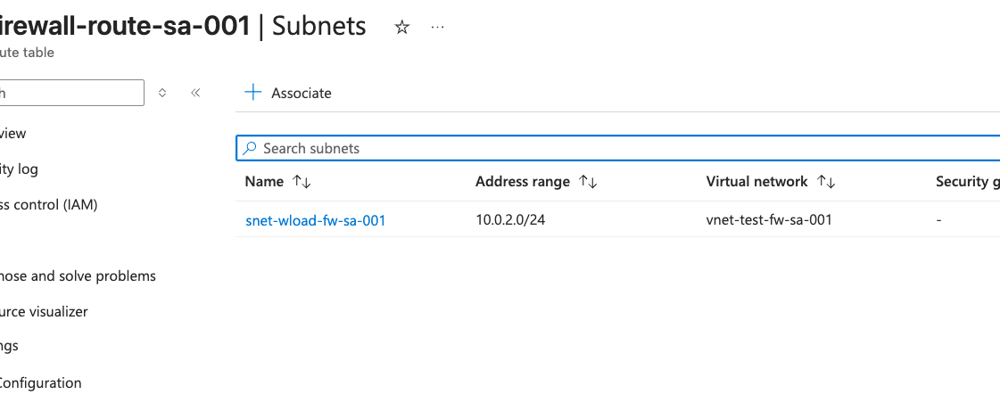
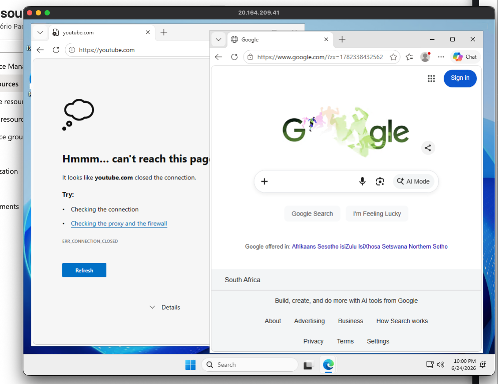

## M06 Unit 07 Deploy and Configure Azure Firewall

## Exercise Scenario
https://microsoftlearning.github.io/AZ-700-Designing-and-Implementing-Microsoft-Azure-Networking-Solutions/Instructions/Exercises/M06-Unit%207%20Deploy%20and%20configure%20Azure%20Firewall%20using%20the%20Azure%20portal.html

## Architecture Overview
Deployed and configured Azure Firewall Standard with a Firewall Policy to control inbound and outbound traffic for a workload virtual machine.

## Azure Resources Deployed
- Azure Virtual Network and Subnets
- Azure Firewall 
- Public IP Address
- Route Table
- Windows Virtual Machine
...

## Traffic Flow
- Inbound RDP: Internet → Firewall Public IP :3389 → DNAT → Srv-Work :3389
- Outbound HTTP/S: Srv-Work → Route Table → Firewall → Application Rules → Internet (Google allowed / Youtube blocked)

## Connectivity Validation
The following validations were performed:
- Azure Firewall deployed successfully with Standard SKU
- Firewall Policy created and associated to firewall
- Route table associated to subnet_worload only
- Default route 0.0.0.0/0 pointing to firewall (Forced Tunneling)
- RDP connection to Srv-Work via firewall public IP successful
- www.google.com accessible through firewall 
- www.youtube.com blocked by firewall (no matching allow rule)

## Screenshots
### Resources

### Azure Firewall

### Firewall Policy 

### Route Table

### Virtual Machine Tests

## Terraform Outputs (Verification)
firewall_public_ip  = "20.164.209.41"
firewall_private_ip = "10.0.1.4"
vm_private_ip       = "10.0.2.4"