## M06 Unit 09 Secure your Virtual Hub using Azure Firewall Manager

## Exercise Scenario
https://microsoftlearning.github.io/AZ-700-Designing-and-Implementing-Microsoft-Azure-Networking-Solutions/Instructions/Exercises/M06-Unit%209%20Secure%20your%20virtual%20hub%20using%20Azure%20Firewall%20Manager.html

## Architecture Overview
Deployed a Secured Virtual Hub using Azure Virtual WAN and Azure Firewall Manager. Two spoke VNets were connected to the hub, with Routing Intent enforcing that both internet-bound and private (spoke-to-spoke) traffic are inspected by Azure Firewall before reaching their destination.

## Azure Resources Deployed
- Azure Virtual WAN
- Secured Virtual Hub
- Azure Firewall (Hub SKU) + Firewall Policy
- Two Spoke Virtual Networks and Workload Subnets
- Hub-to-Spoke Virtual Hub Connections
- Routing Intent (Internet + Private traffic policies)
- Two Windows Virtual Machines (Srv-workload-01, Srv-workload-02)

## Traffic Flow
- Inbound RDP: Internet → Firewall Public IP :3389 → DNAT → Srv-workload-01 :3389
- Internal remote Access(East-West): Spoke-01 → Hub → Firewall → Network Rules → Srv-workload-02 :3389
- Outbound to Internet: Workload VM → Hub Routing Intent → Firewall → Application Rules → Internet (*.microsoft.com allowed / other destinations blocked)

## Connectivity Validation
The following validations were performed:
- Virtual WAN and Secured Virtual Hub deployed successfully
- Azure Firewall deployed and associated with Firewall Policy
- Hub-to-Spoke connections established
- Routing Intent applied for both Internet and Private traffic, next hop set to Azure Firewall
- Effective Routes on workload NICs confirm 0.0.0.0/0 next hop = Virtual Appliance (Firewall)
- DNAT rule validated — RDP to Srv-workload-01 via firewall public IP successful
- Network rule validated — RDP from Spoke-01 to Srv-workload-02 successful through hub
- Application rule validated — *.microsoft.com accessible through firewall
- Non-allowed destinations blocked by default deny (no matching allow rule)

## Screenshots
### Resources
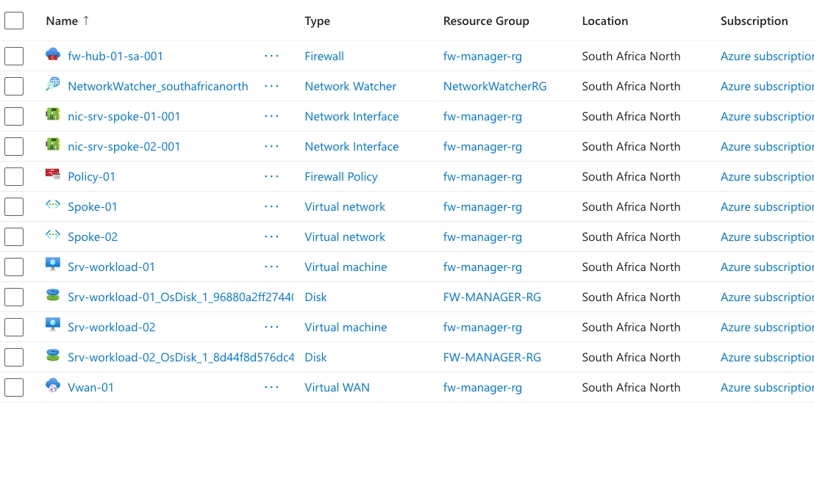

### Virtual WAN / Secured Hub
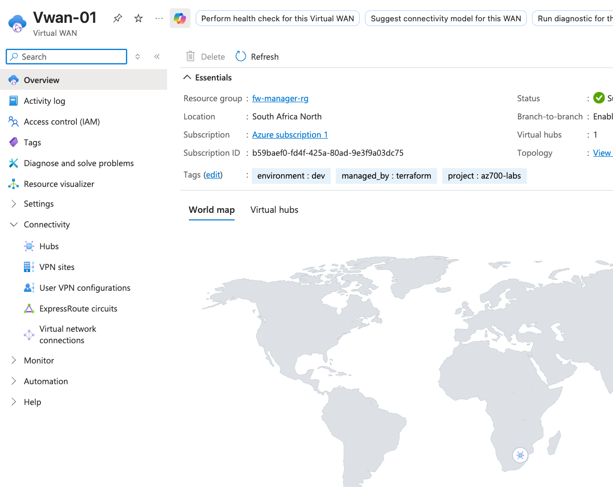
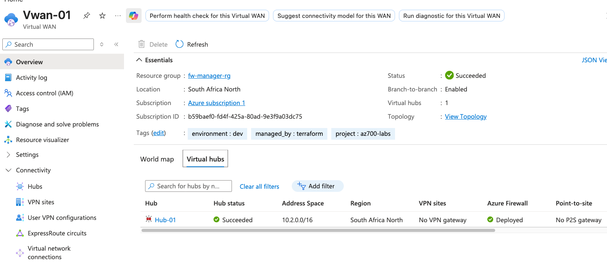
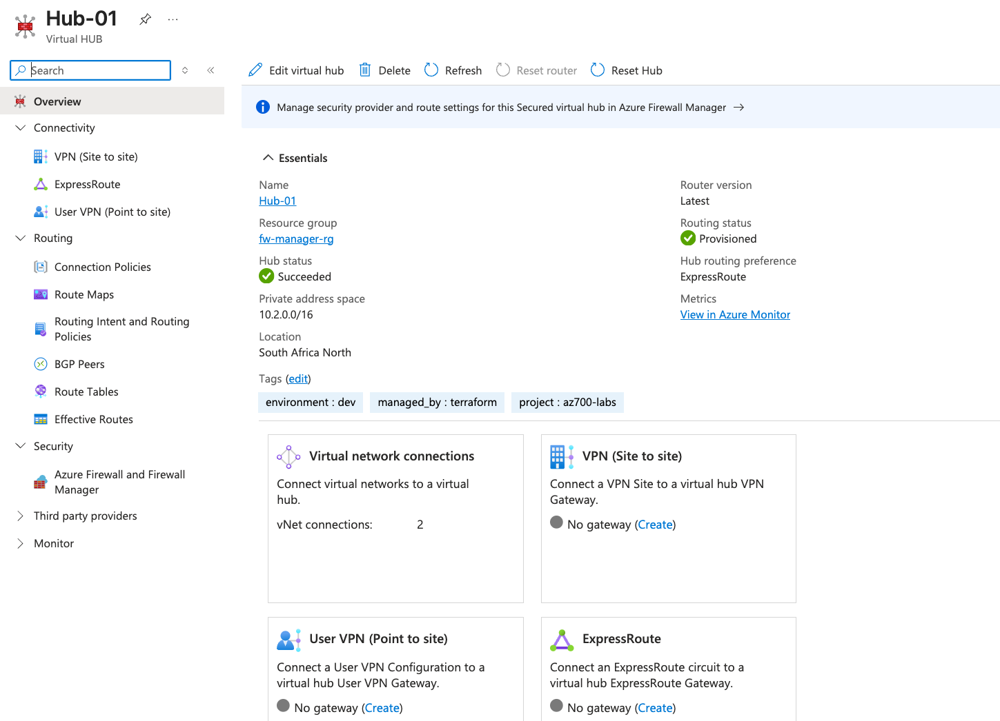

### Azure Firewall
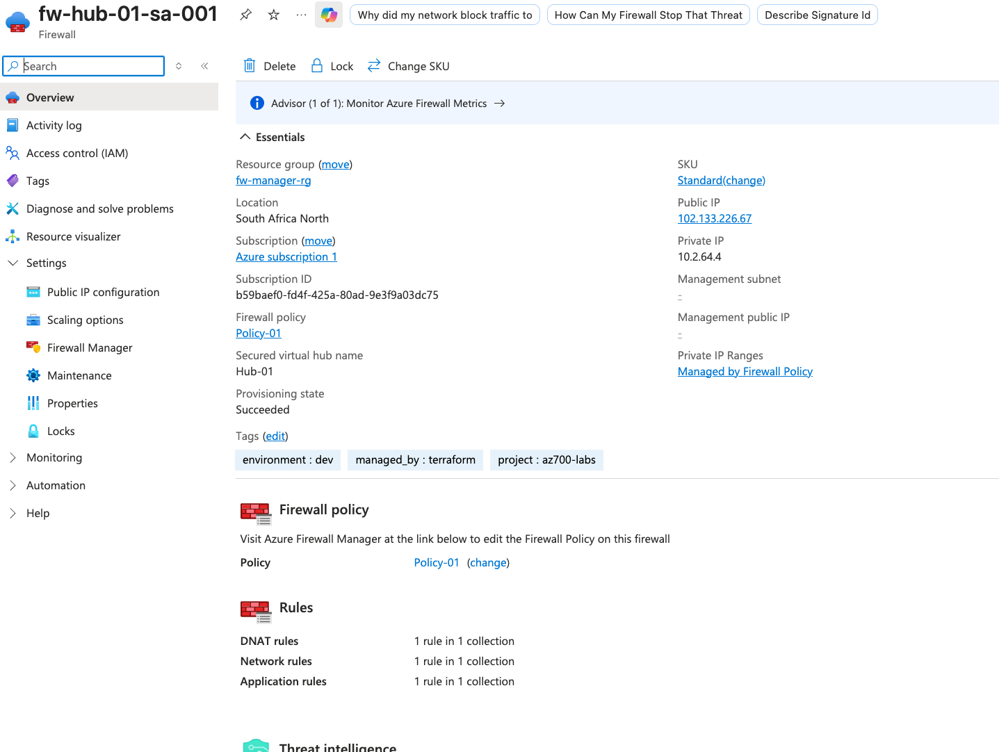

### Firewall Policy
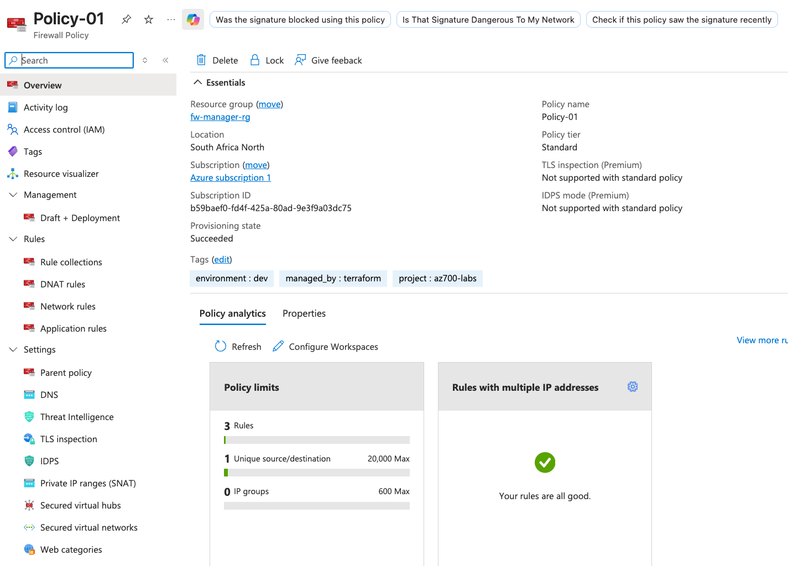
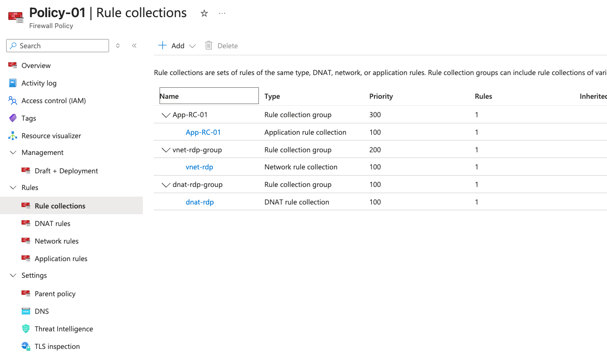
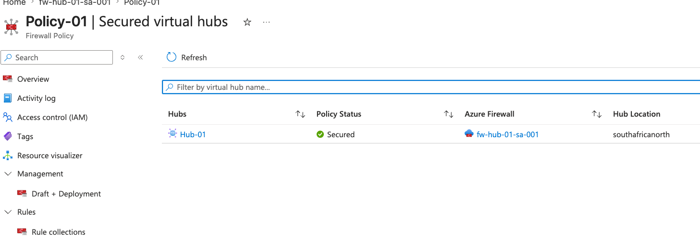

### Routing Intent / Effective Routes
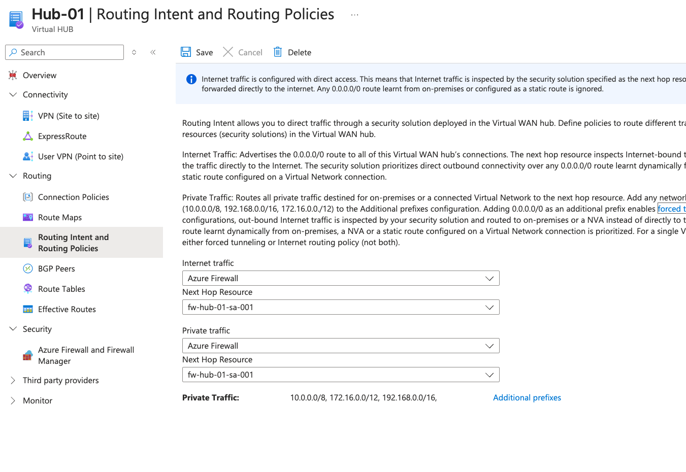
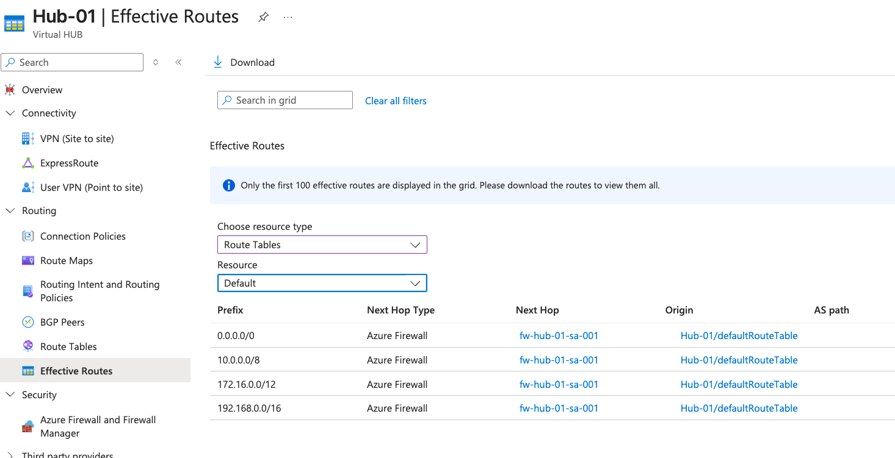

### Virtual Machine Tests
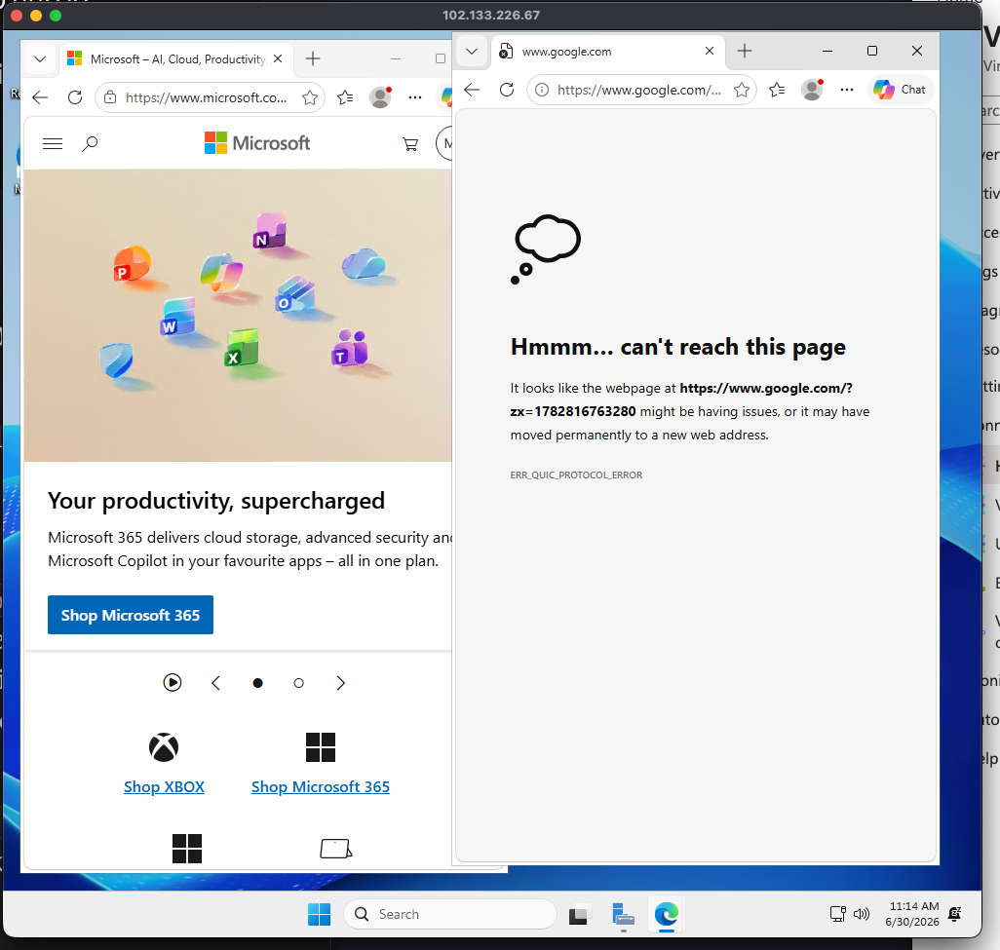
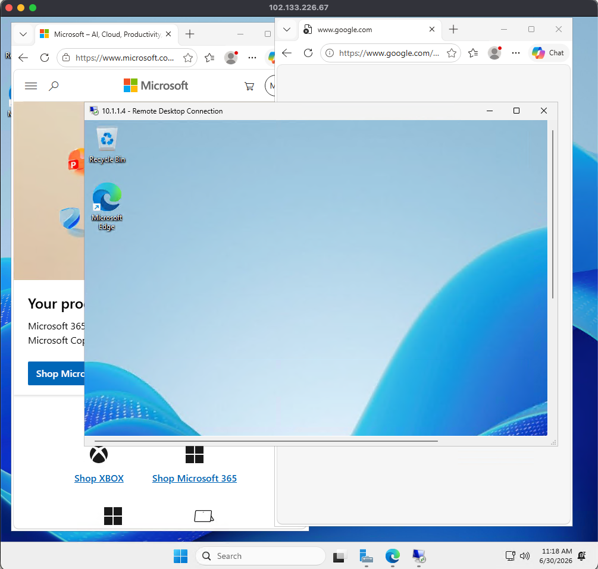

## Terraform Outputs (Verification)
hub_firewall_public_ip = "102.133.226.67"
virtual_hub_id = "/subscriptions/.../resourceGroups/fw-manager-rg/providers/Microsoft.Network/virtualHubs/Hub-01"
vm_private_ips = {
  "spoke_01" = "10.0.1.4"
  "spoke_02" = "10.1.1.4"
}