## M07 Unit 05 Restrict Network Access to PaaS Resources with Virtual Network Service Endpoints

## Exercise Scenario
https://microsoftlearning.github.io/AZ-700-Designing-and-Implementing-Microsoft-Azure-Networking-Solutions/Instructions/Exercises/M07-Unit%205%20Restrict%20network%20access%20to%20PaaS%20resources%20with%20virtual%20network%20service%20endpoints.html

## Architecture Overview
Deployed a Virtual Network with a Public and a Private subnet. Enabled a Microsoft.Storage Service Endpoint on the Private subnet and restricted a Storage Account to accept traffic only from that subnet, removing public internet access to the storage account entirely.

## Azure Resources Deployed
- Azure Virtual Network and Subnets (Public, Private)
- Network Security Group (ContosoPrivateNSG) with Outbound/Inbound rules
- Network Security Group (ContosoPublicNSG) for RDP testing
- Storage Account with Service Endpoint network restriction
- Azure Files Share (marketing)
- Two Windows Virtual Machines (Srv-Public, Srv-Private)

## Traffic Flow
- Inbound RDP (Public VM): Internet → NSG (Allow-RDP-Public) → Srv-Public :3389
- Outbound to Storage (Private VM): Srv-Private → Service Endpoint (Microsoft.Storage) → Azure Backbone → Storage Account :445
- Outbound to Internet (Private VM): Srv-Private → NSG (Deny-Internet-All) → Blocked
- Storage Account Access: Public network access denied by default; only the Private subnet (via Service Endpoint) is permitted

## Connectivity Validation
The following validations were performed:
- Virtual Network and both subnets deployed successfully
- Service Endpoint (Microsoft.Storage) enabled on the Private subnet
- ContosoPrivateNSG associated to Private subnet — Allow-Storage-All, Deny-Internet-All, Allow-RDP-All rules applied
- ContosoPublicNSG associated to Public subnet — Allow-RDP-Public rule applied
- Storage Account network rules set to Deny by default, with only the Private subnet allowed
- RDP connection to Srv-Public via public IP successful
- File share (marketing) mounted successfully from Srv-Private using net use
- nslookup of the storage FQDN still resolves to a public IP (expected — Service Endpoints route over the Azure backbone without rewriting DNS, unlike Private Endpoints)
- Storage account inaccessible from outside the Private subnet (public network access denied)

## Screenshots
### Resources
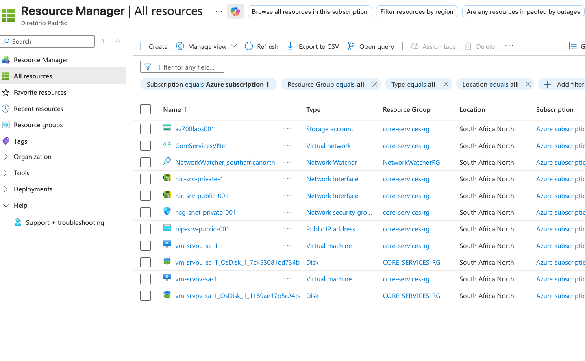

### Network Security Groups
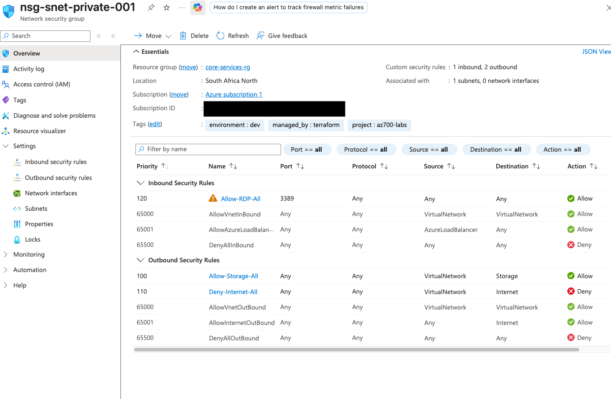
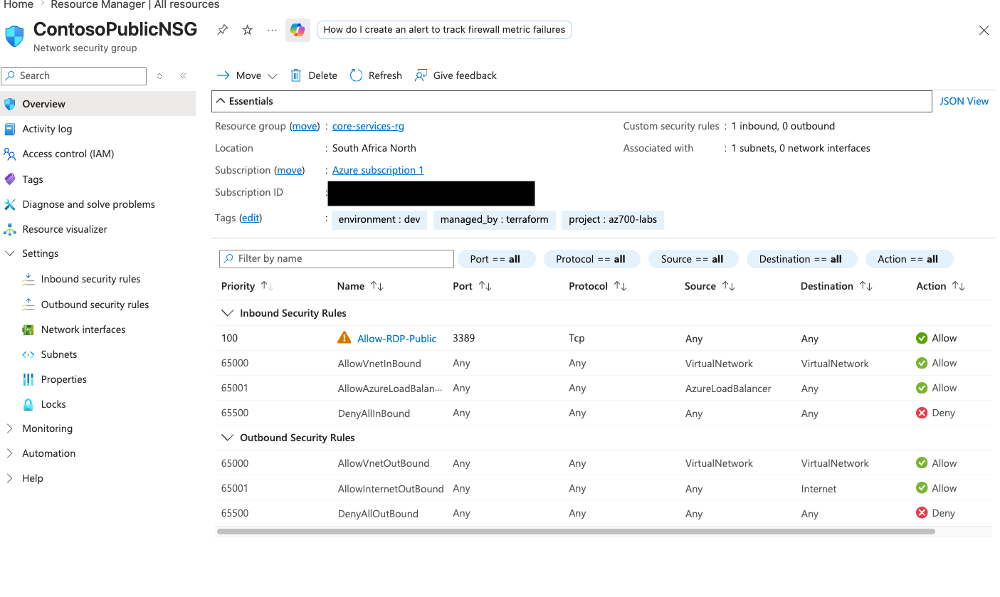

### Storage Account Networking
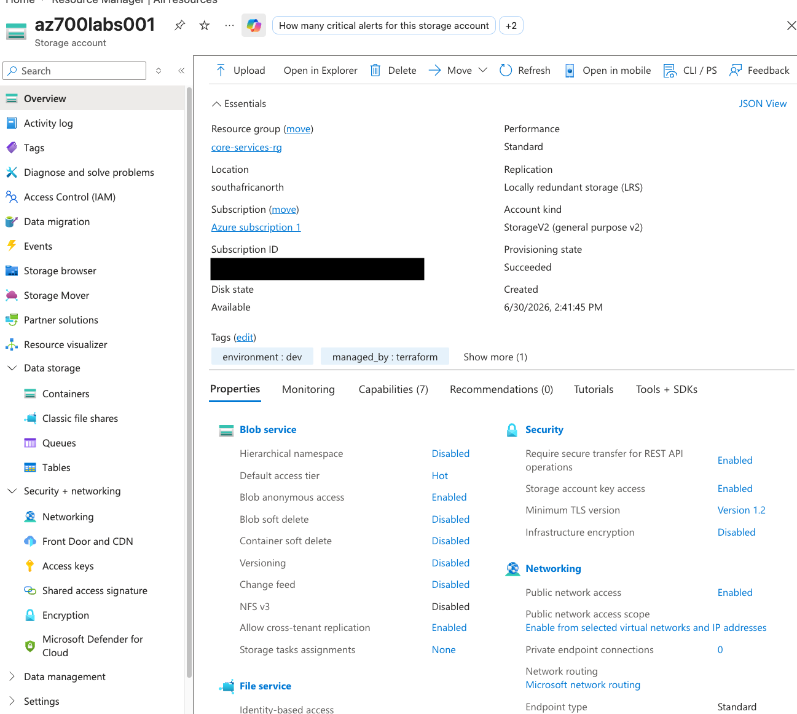
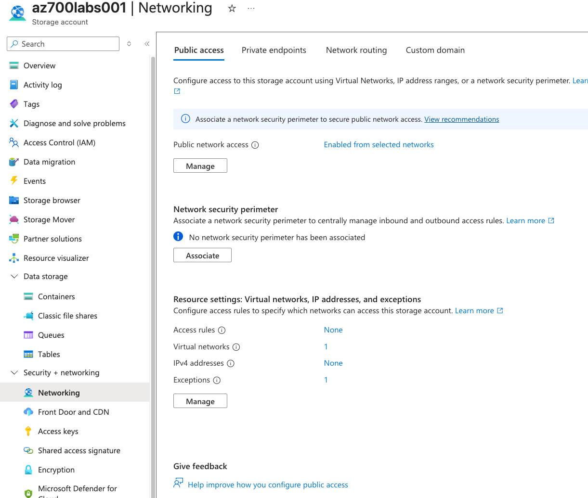

### File Share
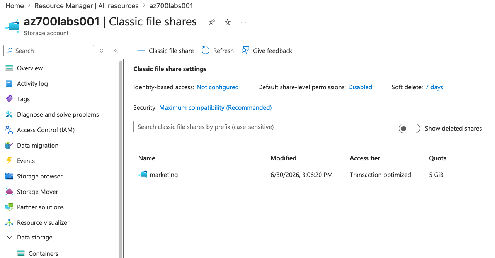

### Access Keys
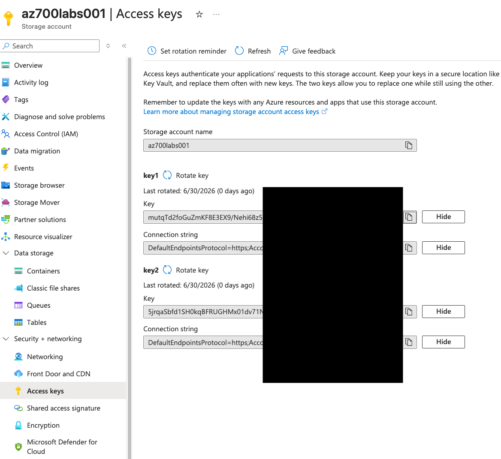

### Virtual Machine Tests
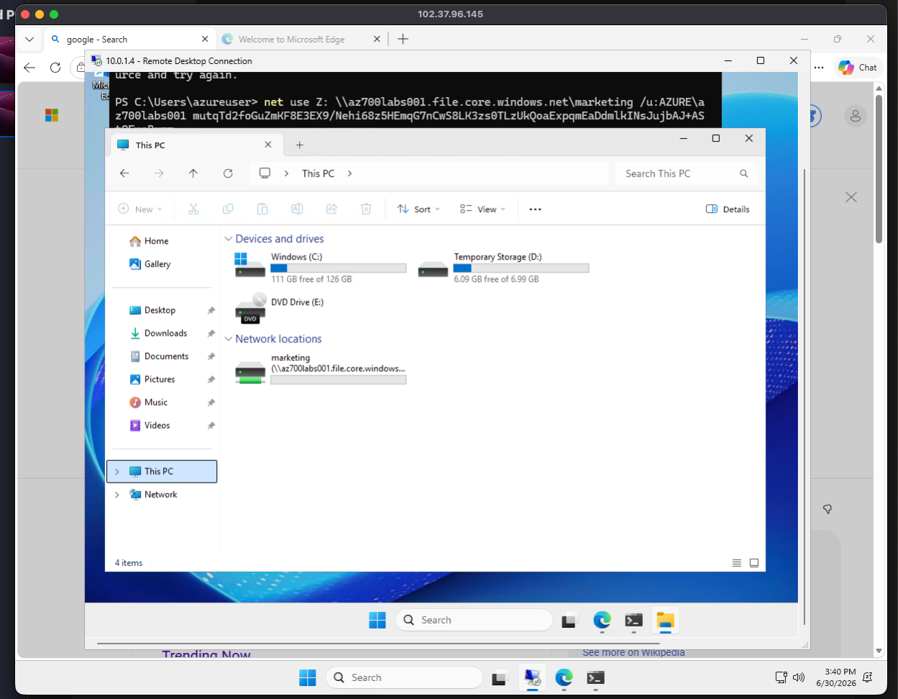
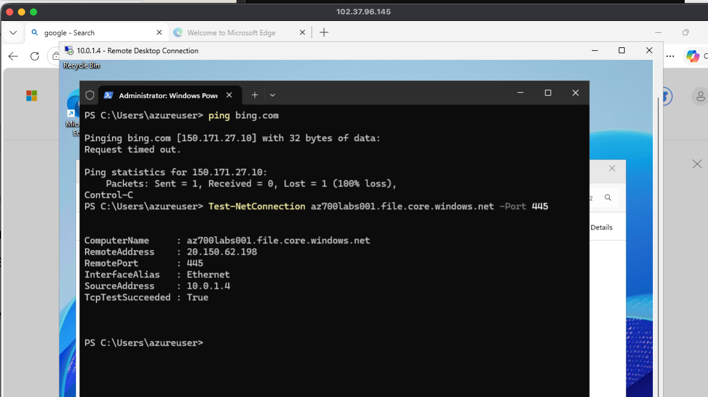
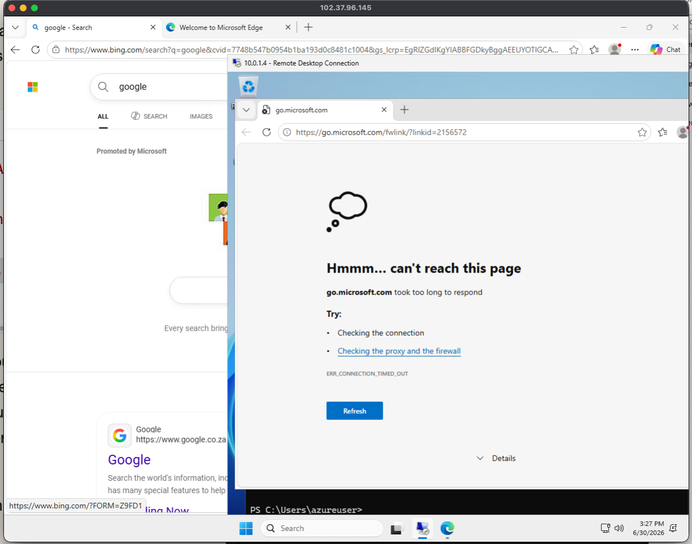

### Global Admin deny access
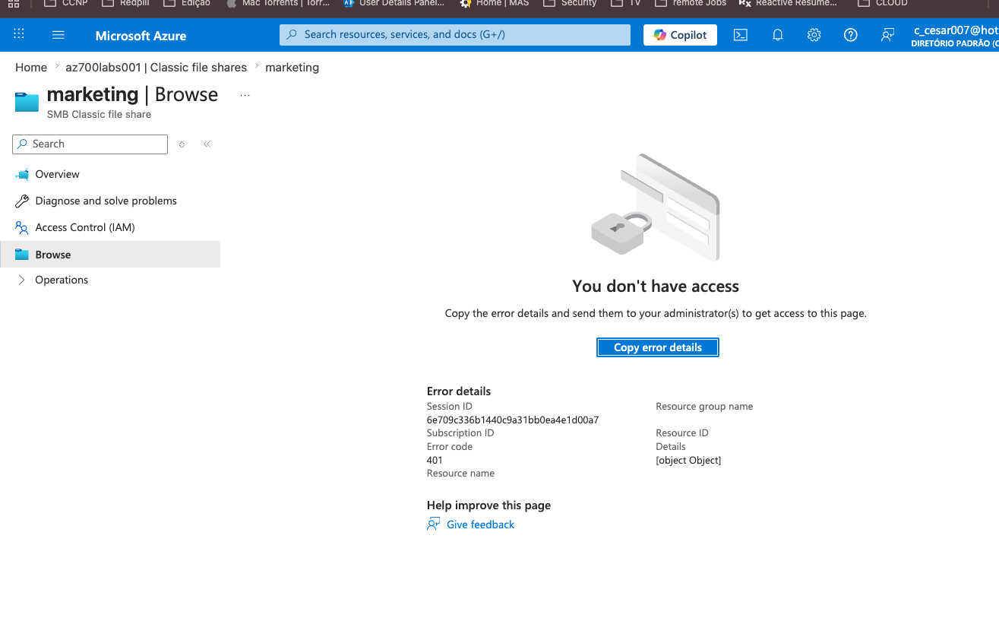

## Terraform Outputs (Verification)
srv_public_ip = "102.37.96.145"
storage_account_name = "az700labs001"
storage_account_primary_key = <sensitive>
vm_private_ips = {
  "srv_private" = "10.0.1.4"
  "srv_public" = "10.0.0.4"
}