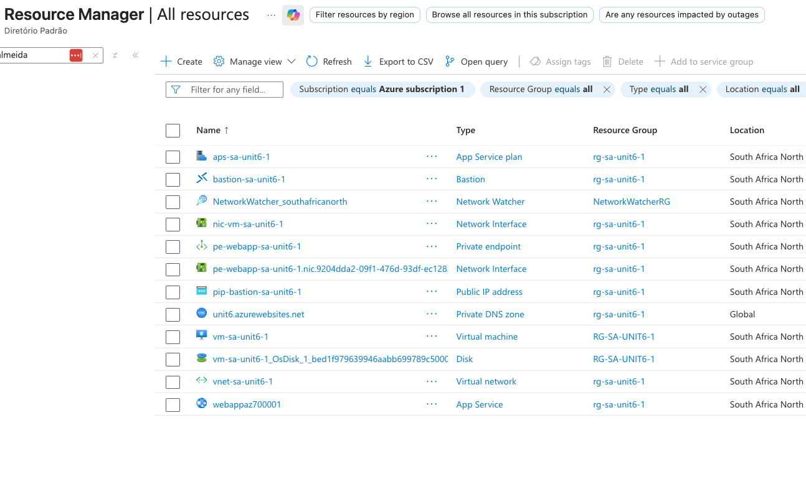
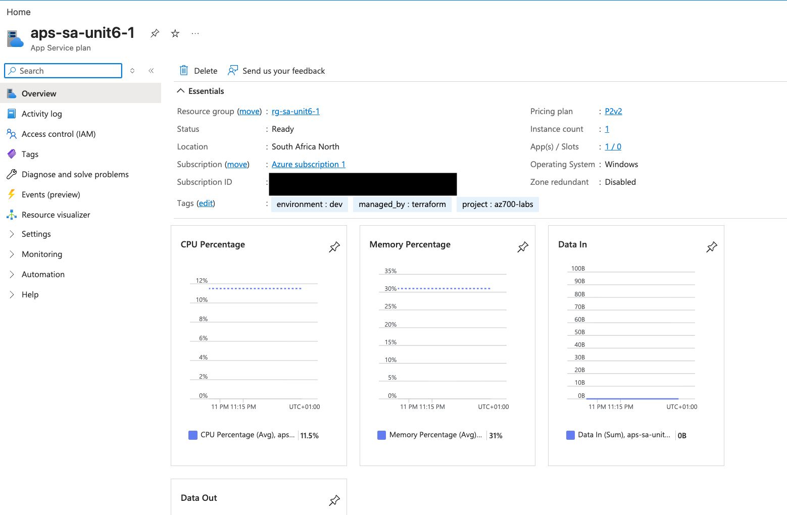
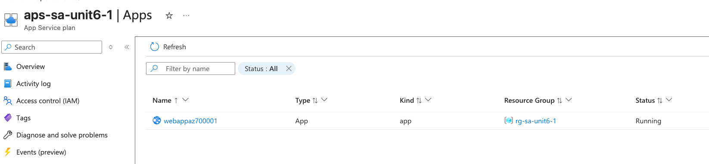
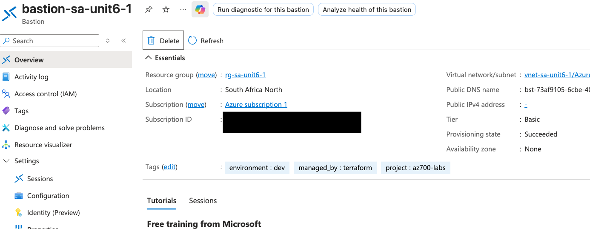
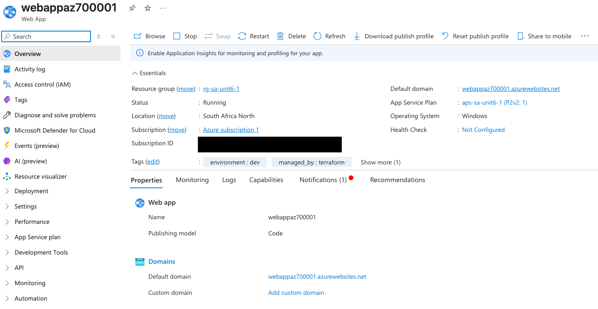
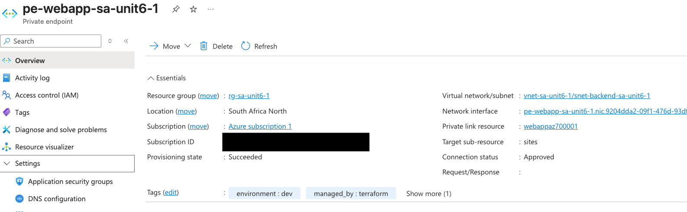
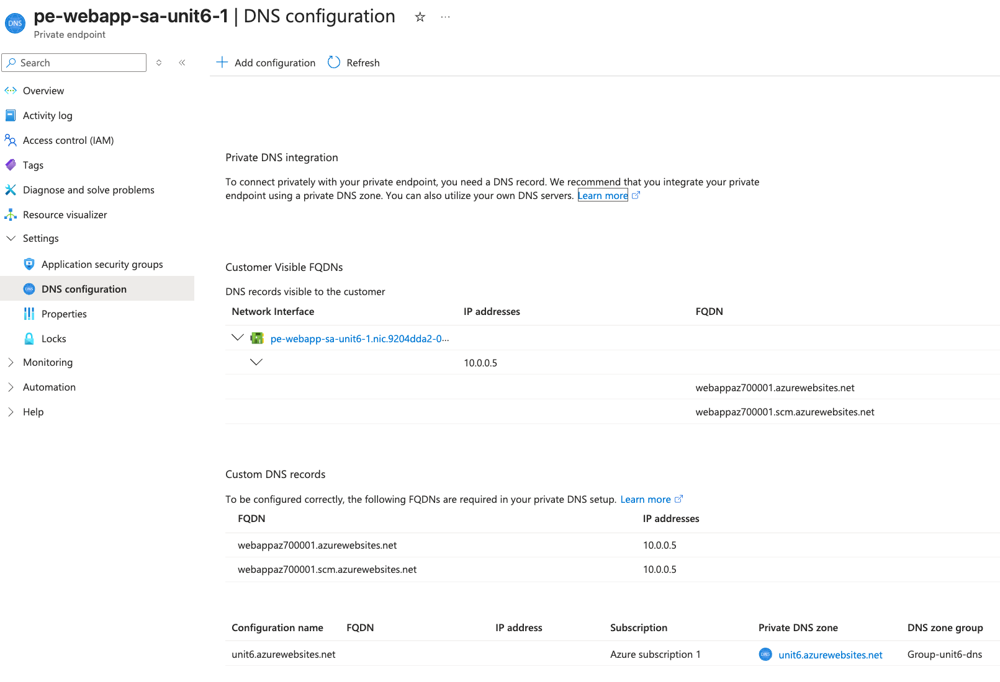
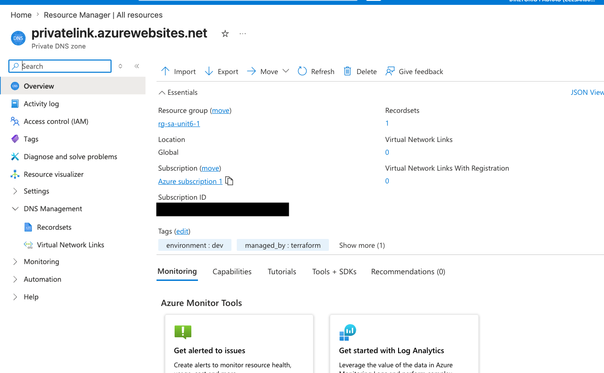
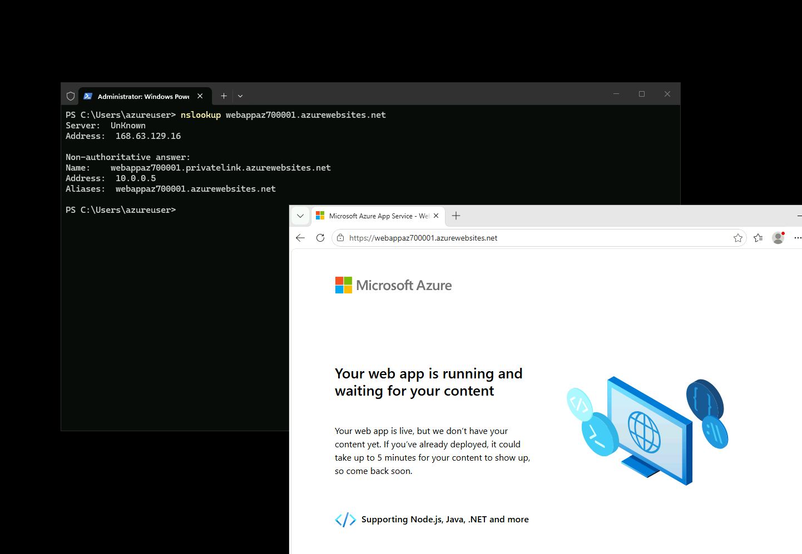

## M07 Unit 06 Create an Azure Private Endpoint

## Exercise Scenario
https://microsoftlearning.github.io/AZ-700-Designing-and-Implementing-Microsoft-Azure-Networking-Solutions/Instructions/Exercises/M07-Unit%206%20Create%20an%20Azure%20private%20endpoint%20using%20Azure%20PowerShell.html

## Architecture Overview
Deployed a Private Endpoint to securely connect to an Azure Web App over a private IP address within the VNet. A Private DNS Zone was configured to rewrite DNS resolution of the Web App FQDN to the private endpoint IP, ensuring no traffic leaves the Azure backbone. Azure Bastion was used to access the test VM without exposing a public IP on the VM.

## Azure Resources Deployed
- Azure Virtual Network and Subnets 
- Azure Bastion Host with Public IP
- App Service Plan (PremiumV2 — required for Private Endpoint support)
- Azure Windows Web App
- Private Endpoint connected to Web App subresource "sites"
- Private DNS Zone
- Private DNS Zone Virtual Network Link
- Private DNS Zone Group 
- Windows Virtual Machine, no public IP accessed via Bastion

## Traffic Flow
- Inbound VM access: Azure Portal → Bastion Public IP → Bastion Host → VM (private IP only)
- Web App resolution (from inside VNet): nslookup webappaz700001.azurewebsites.net → Private DNS Zone → Private Endpoint IP (10.0.0.x)
- Web App traffic: VM → Private Endpoint NIC → Web App (stays on Azure backbone, never hits public internet)
- Public access to Web App: Blocked — private endpoint restricts inbound connections to VNet only

## Connectivity Validation
The following validations were performed:
- Virtual Network, subnets, and Bastion deployed successfully
- App Service Plan (P2v2) and Web App deployed successfully
- Private Endpoint created and status shows "Approved"
- Private DNS Zone created and linked to VNet
- DNS Zone Group auto-registered the Private Endpoint IP into the DNS Zone
- nslookup webapp.azurewebsites.net from inside VM resolved to private IP
- Web App accessible from VM via private IP

## Screenshots
### Resources

### Application Service Plan

### Bastion Host

### Web App

### Private Endpoint

### Private DNS Zone

### Virtual Machine Tests (via Bastion)

## Terraform Outputs (Verification)
bastion_public_ip = "40.123.240.101"
private_endpoint_ip = "10.0.0.5"
vm_private_ip = "10.0.0.4"
webapp_hostname = "webappaz700001.azurewebsites.net"