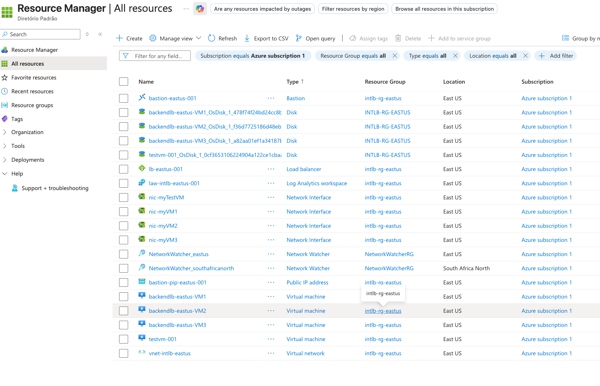
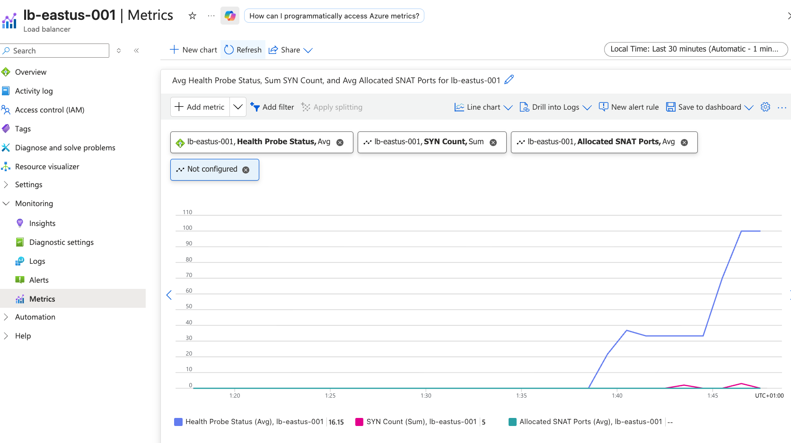
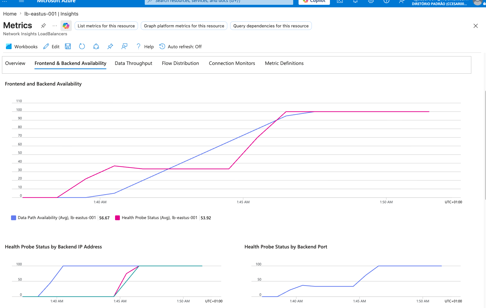
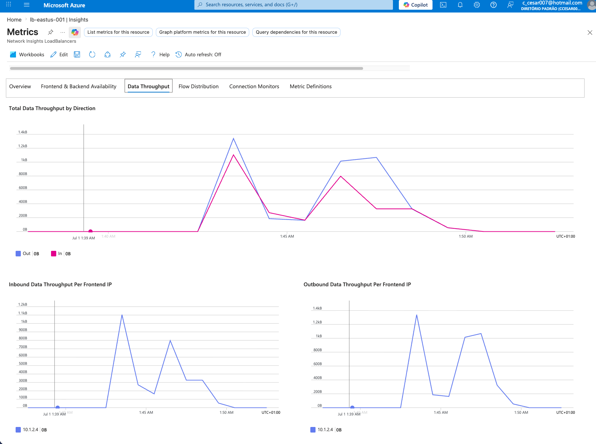
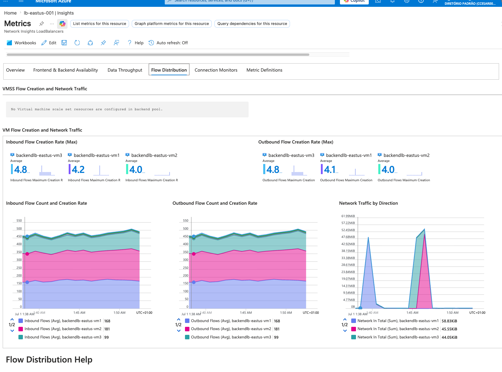
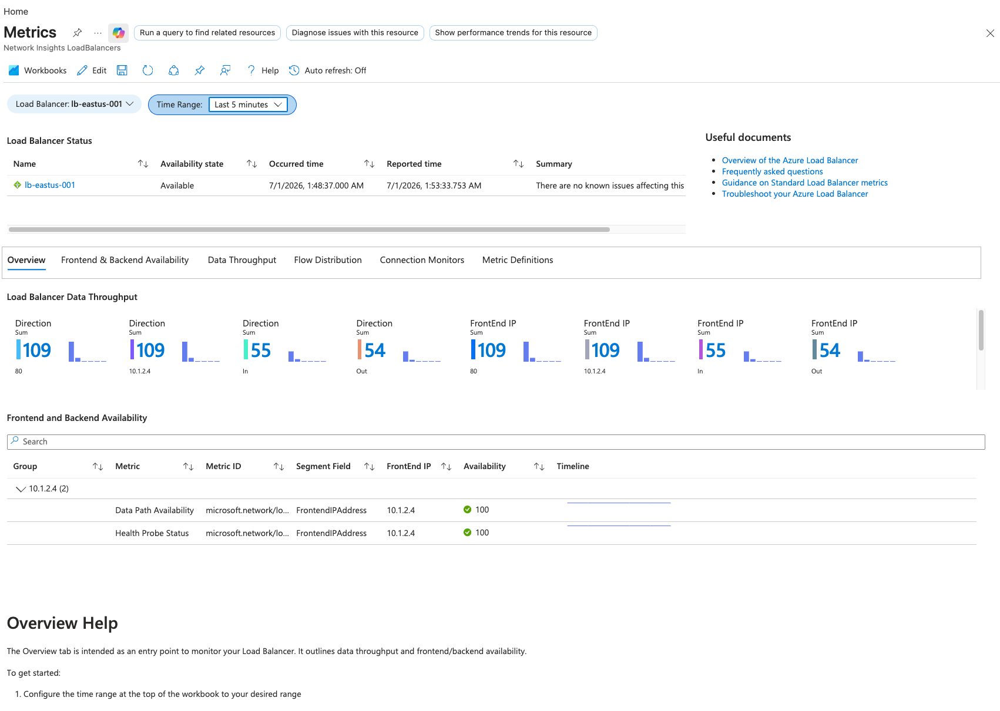
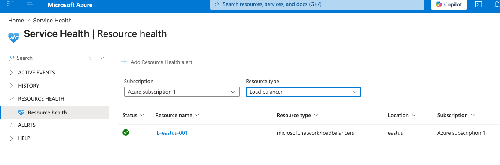
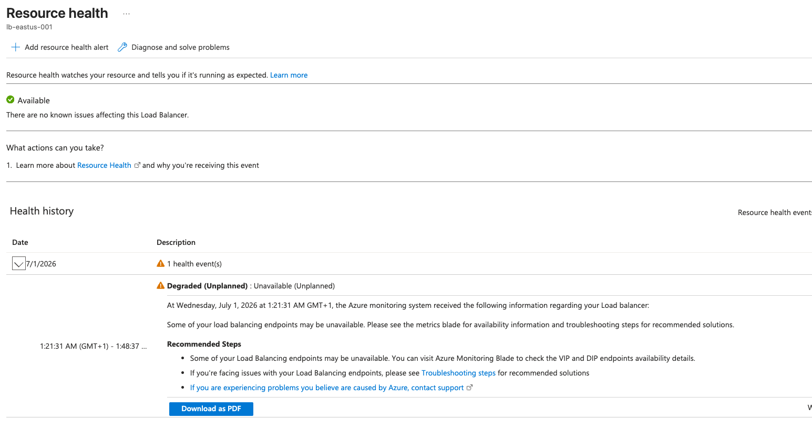

## M08 Unit 03 Monitor a Load Balancer Resource using Azure Monitor

## Exercise Scenario
https://microsoftlearning.github.io/AZ-700-Designing-and-Implementing-Microsoft-Azure-Networking-Solutions/Instructions/Exercises/M08-Unit%203%20Monitor%20a%20load%20balancer%20resource%20using%20Azure%20Monitor.html

## Architecture Overview
Extended the Internal Load Balancer lab (M04 Unit 4) with Azure Monitor observability. Created a Log Analytics Workspace and configured Diagnostic Settings on the Load Balancer to stream metrics. Used Azure Monitor Insights to explore the Functional Dependency View, detailed metrics, and resource health.

## Azure Resources Deployed
- Azure Internal Standard Load Balancer (existing from M04)
- Virtual Network and Subnets (existing from M04)
- Azure Bastion (existing from M04)
- 3 Linux Web Server VMs — Backend Pool (existing from M04)
- 1 Windows Client VM (existing from M04)
- Log Analytics Workspace
- Diagnostic Settings — Load Balancer metrics streamed to Log Analytics Workspace

## Traffic Flow
- Client VM → Internal Load Balancer (private IP) → Backend Pool → Web Servers
- Load Balancer metrics → Diagnostic Settings → Log Analytics Workspace → Azure Monitor

## Connectivity Validation
The following validations were performed:
- Log Analytics Workspace deployed successfully
- Diagnostic Settings configured on Load Balancer
- Azure Monitor → Load Balancer Insights → Functional Dependency View loaded successfully
- Detailed metrics visible in Azure Monitor (data plane metrics, health probe status)
- Resource Health confirmed Load Balancer status as healthy
- Diagnostic Settings confirmed in Portal — Log Analytics Workspace listed as destination

## Screenshots
### Resources

### Azure Monitor and Metrics

### Resource Health

## Terraform Outputs (Verification)
lb_private_ip = "10.1.2.4"
log_analytics_workspace_id = "/subscriptions/.../resourceGroups/intlb-rg-eastus/providers/Microsoft.OperationalInsights/workspaces/law-intlb-eastus-001"

